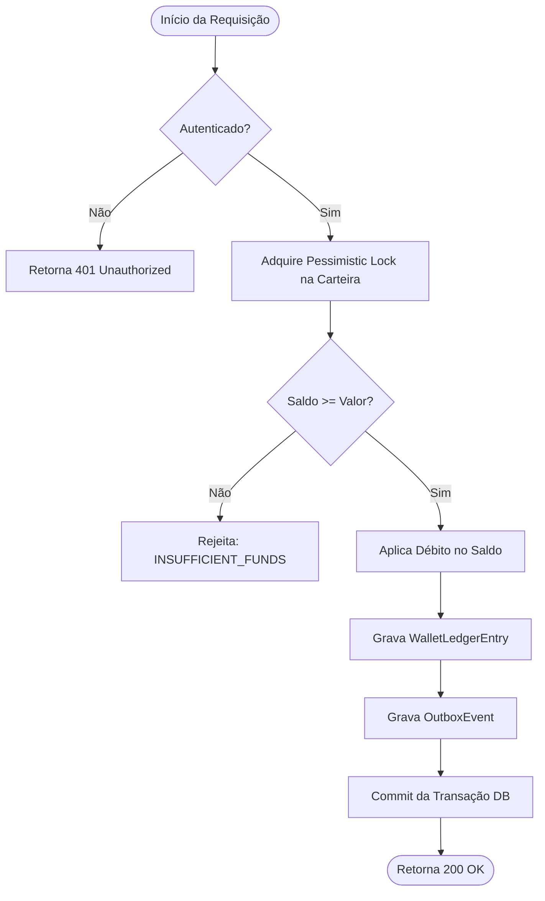
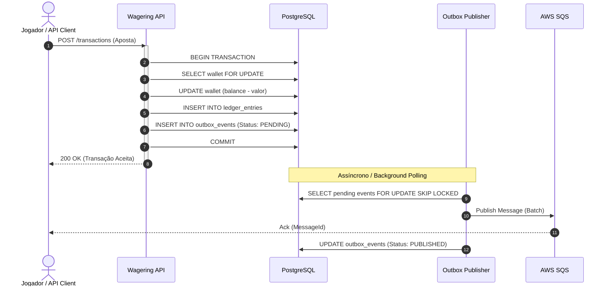
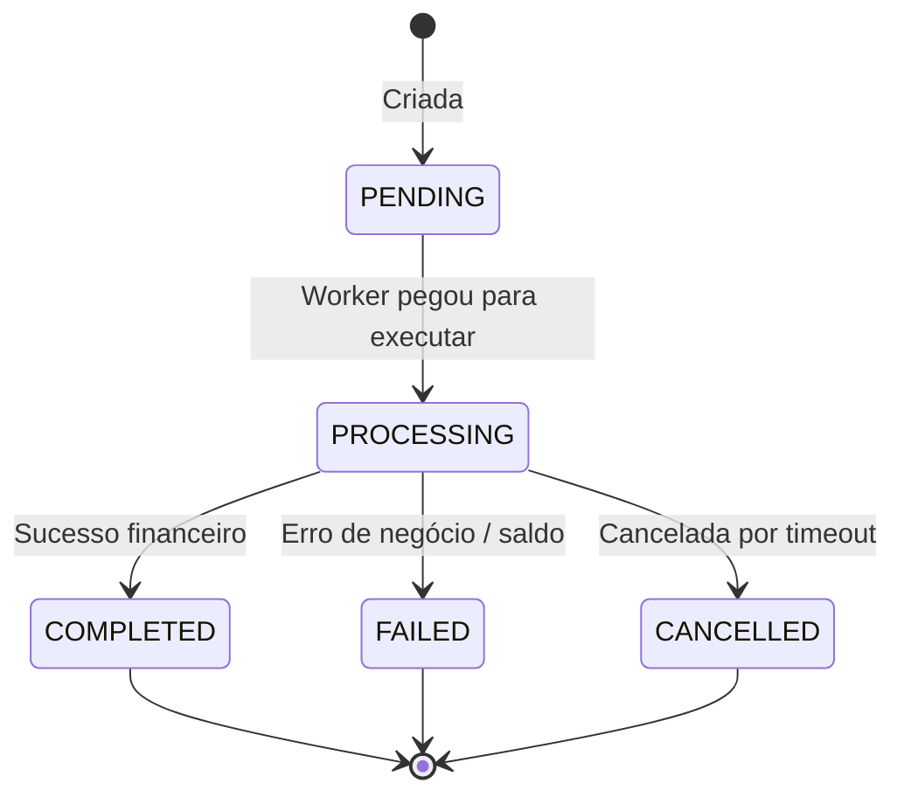
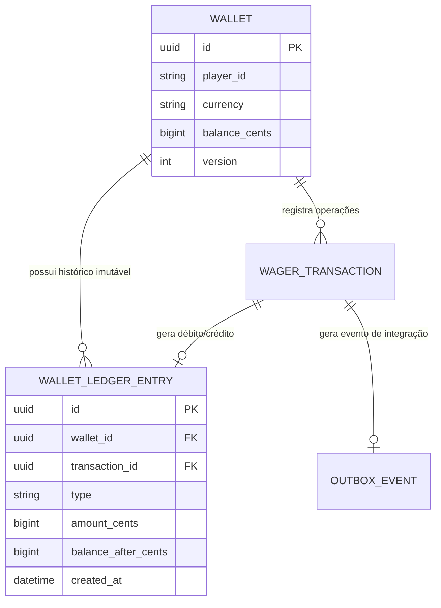

# Padrões Mermaid para a Skill Entenda

Ao gerar diagramas Mermaid nos documentos técnicos, use o padrão mais adequado para a natureza do fluxo:

---

## 1. Fluxo de Execução / Decisão (Flowchart)

Ideal para branches lógicos, pipelines e árvores de decisão.

---

## 2. Comunicação entre Serviços e Componentes (Sequence Diagram)

Ideal para fluxos distribuídos, workers, filas (SQS/Kafka), outbox pattern e chamadas HTTP.

---

## 3. Máquina de Estados / Ciclo de Vida (State Diagram)

Ideal para transações financeiras, status de pedidos e ciclo de vida de entidades.

---

## 4. Estrutura de Agregados e Entidades (ER Diagram)

Ideal para demonstrar relacionamentos entre Aggregates e Ledger.

