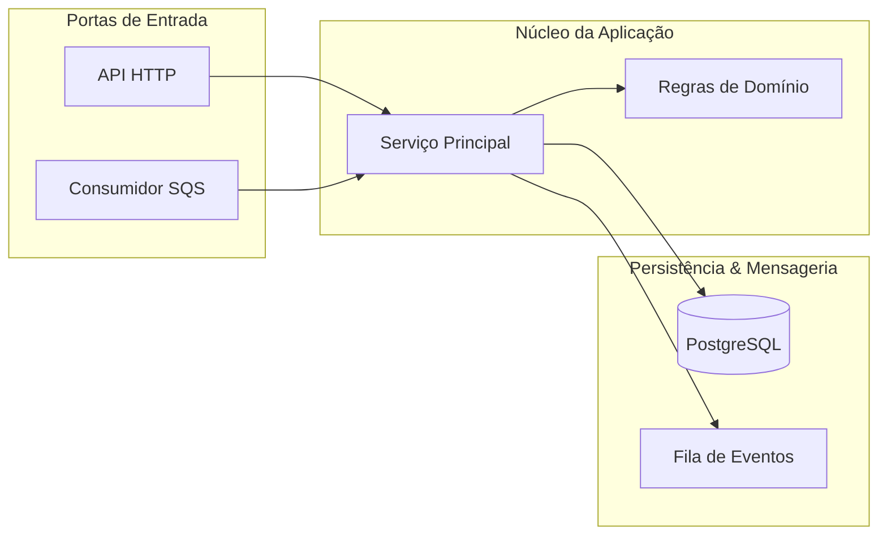
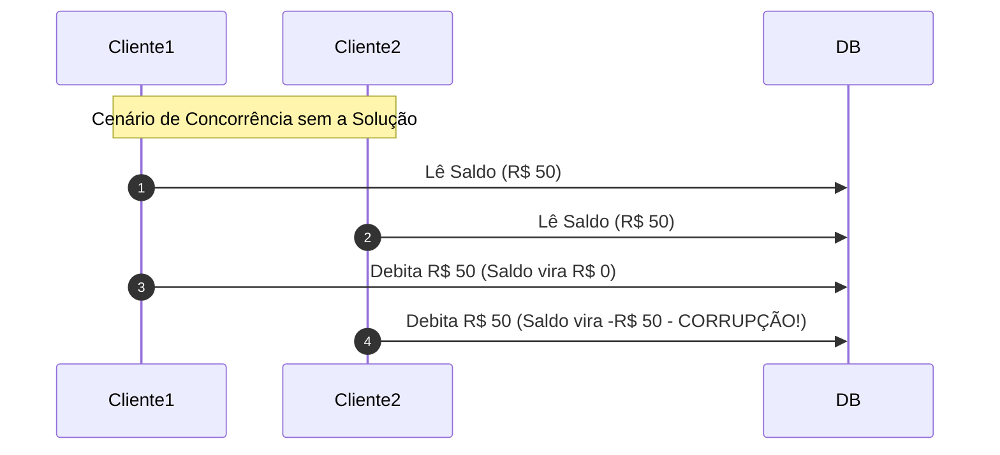
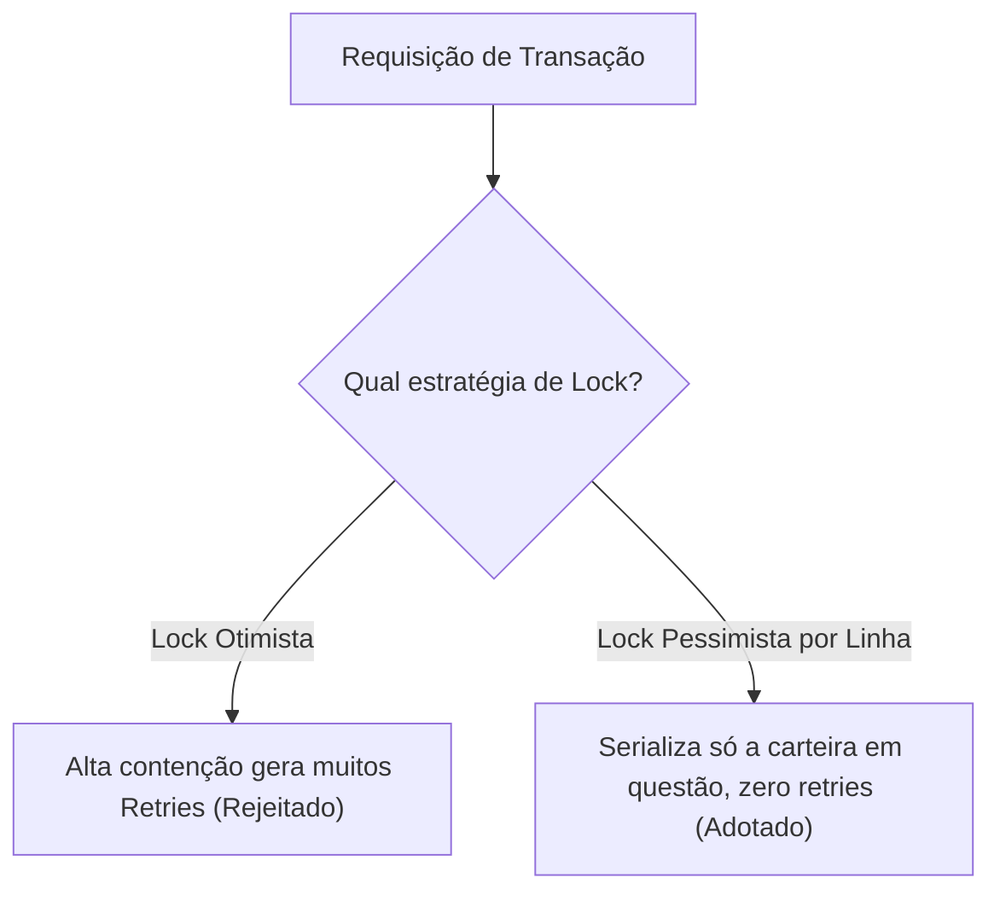
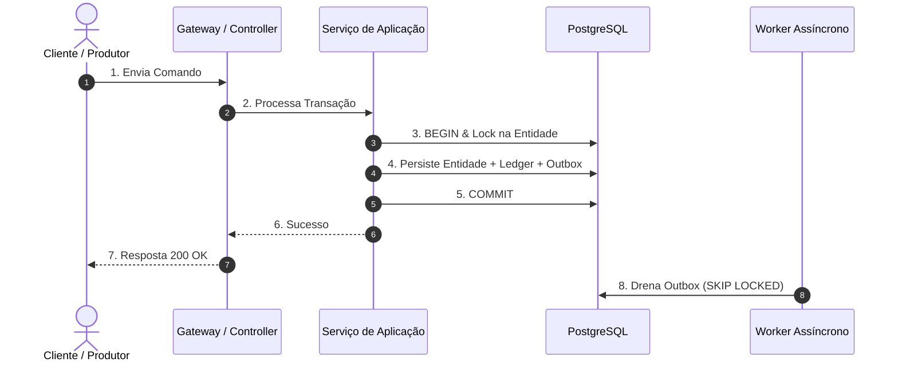
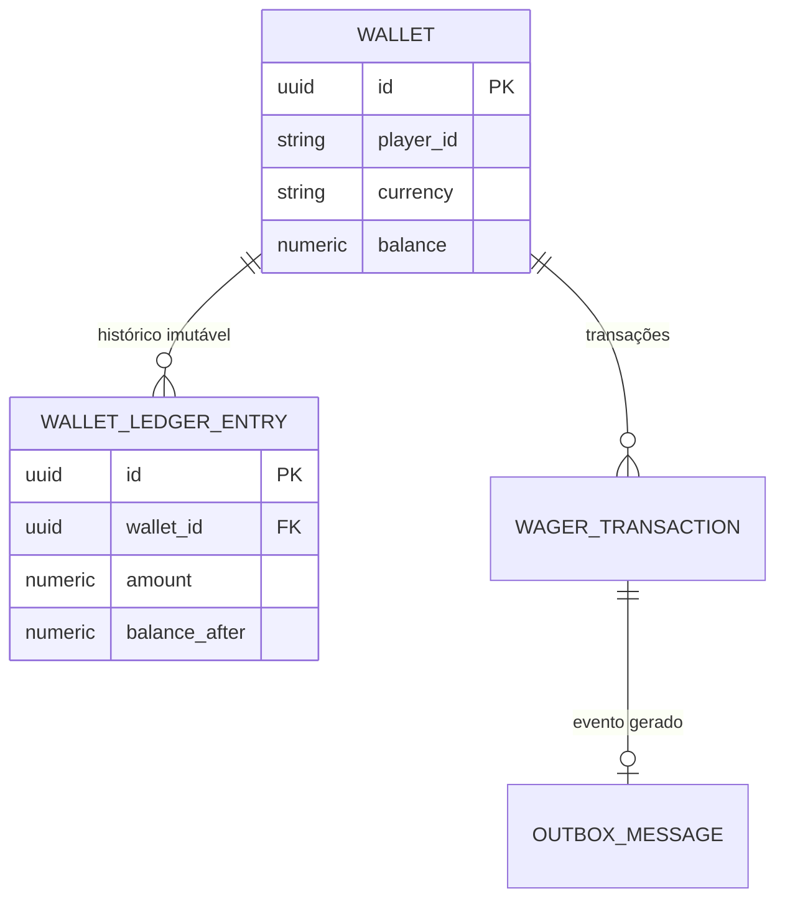
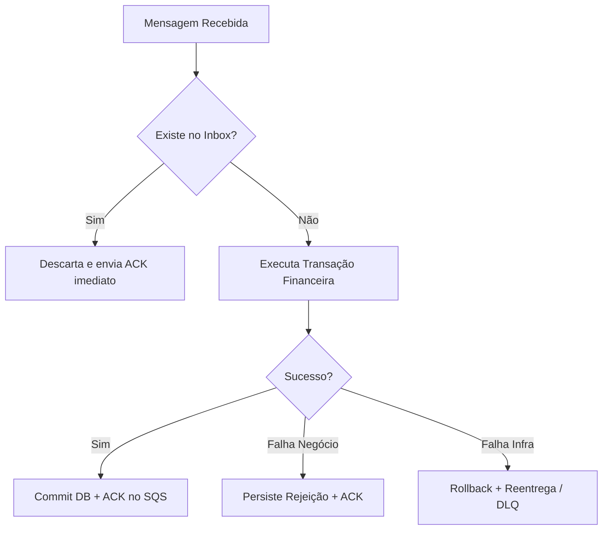

# {Nome do Componente / Arquitetura}

> **Resumo**: {Descrição técnica direta em 1-2 linhas sobre a responsabilidade do módulo}.

---

## 1. Visão Geral & Escopo

{Descrição do papel do componente e seus limites arquiteturais.}

---

## 2. Contexto do Problema & Riscos Evitados

{Explicação dos desafios de concorrência, consistência ou falhas.}

---

## 3. Decisões de Arquitetura & Trade-offs

| Decisão Adotada | Alternativa Rejeitada | Justificativa / Trade-off |
| :--- | :--- | :--- |
| **{Escolha A}** | {Alternativa B} | {Motivo técnico do trade-off} |

---

## 4. Fluxo Visual de Execução Ponta a Ponta

---

## 5. Modelo de Dados & Invariantes

### Estrutura de Agregados

---

## 6. Resiliência e Árvore de Decisão de Falhas

---

## 7. Referências e Arquivos Relacionados

- [`src/...`](file:///absolute/path/to/file.ts) — {Papel do arquivo}
- [`docs/brain/...`](file:///absolute/path/to/doc.md) — {Documento de decisão}
