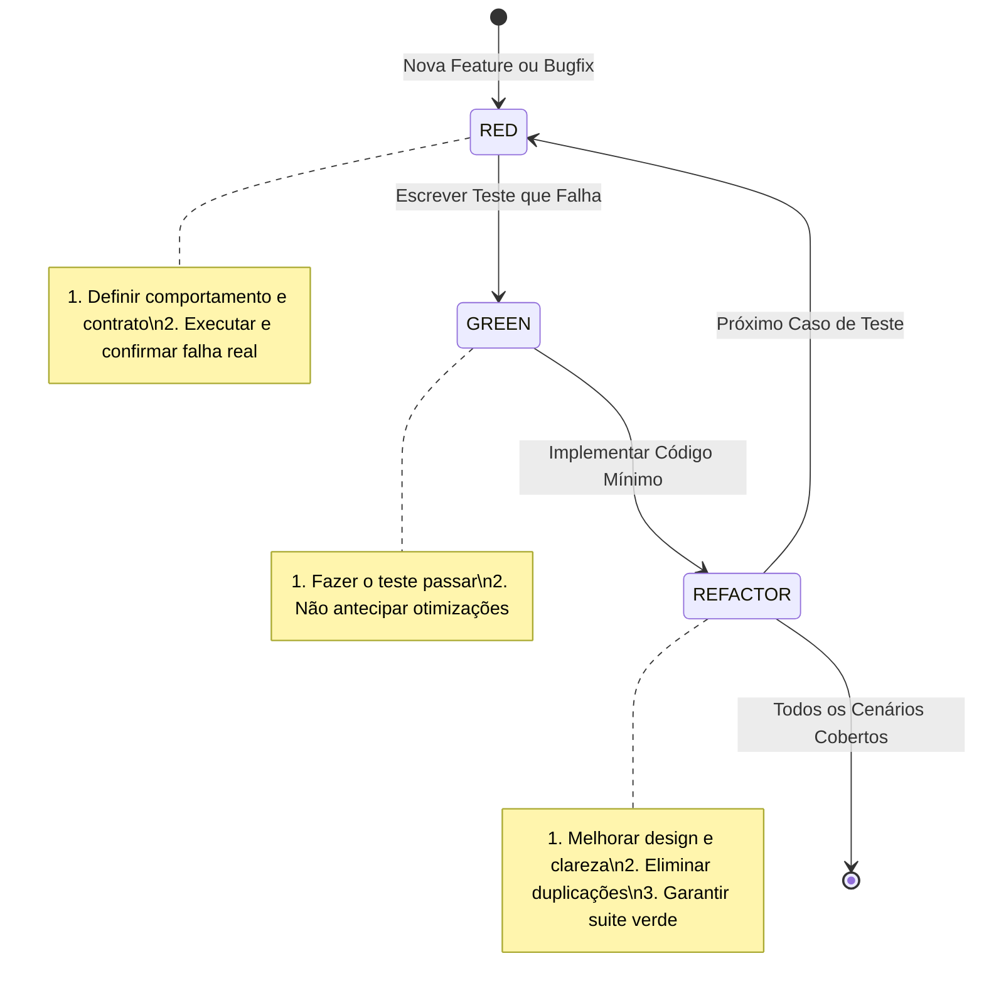

# TDD Skill: Red-Green-Refactor Loop

Esta skill guia o agente no desenvolvimento estrito orientado a testes (TDD). A regra inegociável é: **nenhum código de produção é escrito sem um teste prévio falhando**.

---

## 🔁 O Ciclo Red-Green-Refactor

---

## 📋 Regras de Ouro

1. **Red (Teste Primeiro)**:
   - Escreva o teste antes da implementação.
   - O teste deve verificar comportamento público observável, contratos e invariantes.
   - Execute o teste e confirme que ele realmente falha pelo motivo esperado (não por erro de sintaxe/importação).
2. **Green (Código Mínimo)**:
   - Escreva apenas o código estritamente necessário para fazer o teste passar.
   - Evite antecipar abstrações desnecessárias antes de ter testes que as justifiquem.
3. **Refactor (Limpeza sem quebras)**:
   - Com os testes verdes, refatore o código para melhorar nomes, modularidade e desacoplamento.
   - Execute a suíte de testes completa para garantir zero regressões.
4. **Bugfix via TDD**:
   - Nunca corrija um bug diretamente.
   - Escreva um teste que reproduza exatamente o bug reportado (Red), depois corrija o código até o teste passar (Green).

---

## 📂 Referências

- [aihero.dev/skills-tdd](https://www.aihero.dev/skills-tdd)
