# Arquitetura e decisões técnicas

Este documento conta como pensei para entregar o desafio com rapidez, correção
financeira e espaço para crescer. Ele não descreve uma arquitetura ideal para
todo cliente. Explica as decisões que tomei dentro do timebox, o que o código
prova hoje e o que ainda depende de conversa com o cliente.

Fonte do problema: [Jungle Gaming — Backend Challenge](https://github.com/junglegaming/backend-challenge).

## 1. Visão geral e objetivo

Eu tratei o desafio como um problema financeiro distribuído, não como um CRUD.
O objetivo principal foi garantir que uma operação pudesse chegar repetida,
fora de ordem ou ao mesmo tempo em várias instâncias sem duplicar dinheiro nem
corromper o saldo.

Escolhi um monólito modular NestJS com DDD pragmático e arquitetura hexagonal.
O domínio não conhece NestJS, MikroORM ou AWS. A aplicação coordena os casos de
uso; HTTP, PostgreSQL e SQS ficam nas bordas. Isso manteve uma única fronteira
transacional e ainda deixou divisões claras para uma futura extração.

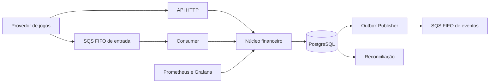

## 2. Como organizei o trabalho

Para construir rápido sem reinterpretar o desafio a cada sessão, transformei o
enunciado em memória e trabalho executável. A sequência foi
**Brain → PRD → issues → TDD**.

- O Brain registra regras, invariantes, decisões e referências para funções. É
  contexto compartilhado entre mim e as LLMs, não uma cópia do código.
- O PRD organiza dependências e ondas de entrega.
- As issues quebram o PRD em fatias verticais pequenas e verificáveis.
- O TDD faz cada fatia nascer com um contrato executável.
- O CI e a pasta `evidencias/` tornam a conclusão reproduzível.

Eu normalmente criaria todas as issues diretamente no GitHub. Durante a
construção usei também arquivos locais como apoio temporário; depois mantive no
tracker somente as issues que deveriam permanecer como histórico público.

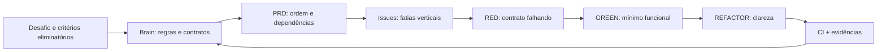

Minha ordem de prioridade foi deliberada: eliminar primeiro os riscos de
dinheiro, concorrência, idempotência e atomicidade; depois fechar operação e
apresentação. Autenticação não pontuava e foi adiada para não competir com o
núcleo financeiro.

## 3. Contexto do problema

Existem duas falhas que guiaram quase todas as decisões.

1. Duas instâncias podem ler o mesmo saldo e aceitar gastos incompatíveis.
2. O banco pode confirmar uma operação e o processo morrer antes de publicar o
   evento correspondente.

SQS FIFO não resolve esses problemas sozinho. Ele mantém a ordem em que as
mensagens chegaram dentro de um grupo, mas não entende a ordem lógica do
domínio. Se `REFUND` chegar antes de `BET`, a FIFO preserva essa chegada
invertida. O sistema precisa continuar correto mesmo assim.

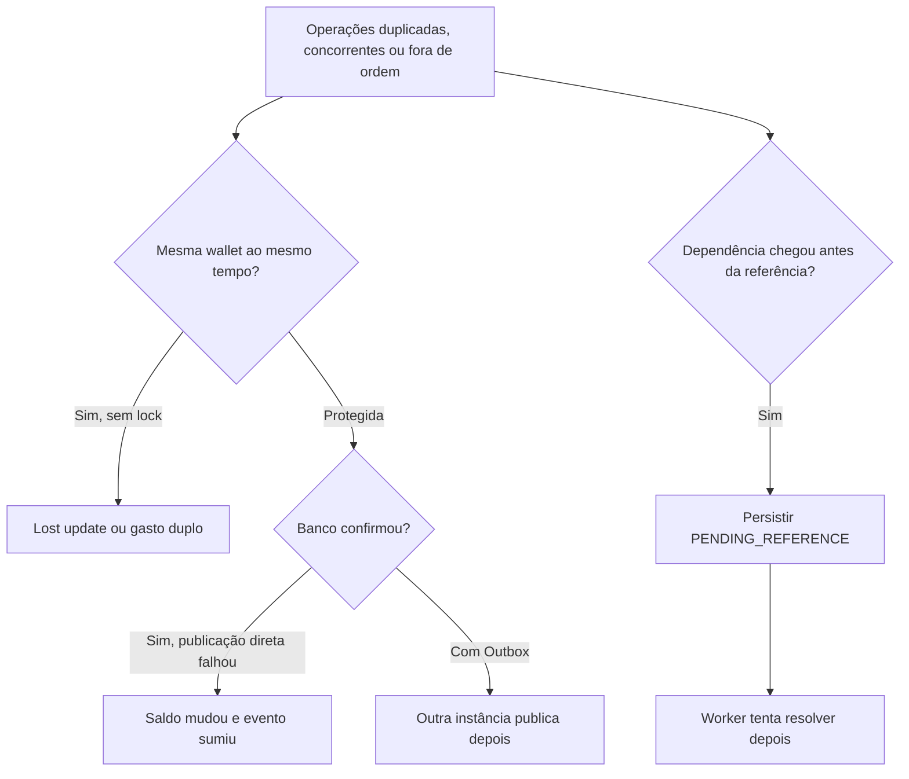

## 4. Decisões e trade-offs

| Decisão | Por que escolhi | Custo aceito |
|---|---|---|
| Monólito modular | Entregar uma boa solução no timebox com uma transação SQL | Escala e deploy ainda são compartilhados |
| MikroORM | Unit of Work, `transactional()` e locks explícitos | Menor ecossistema que alternativas mais populares |
| `decimal.js` + string + `numeric(20,2)` | Precisão monetária no contrato, domínio e banco | Conversões explícitas entre camadas |
| `SELECT ... FOR UPDATE` por wallet | Correção previsível em hot wallet | Serializa a mesma wallet |
| Inbox e Transactional Outbox | Recuperar duplicação e dual write | Mais tabelas, workers e estados operacionais |
| Saldo materializado + ledger | Leitura rápida com histórico auditável | Duas representações precisam reconciliar |
| `PENDING_REFERENCE` | Aceitar dependência fora de ordem sem travar a fila | Consistência eventual e worker adicional |
| Encapsulamento de domínio + mappers | Proteger invariantes das entidades sem acoplamento a ORM | Camada explícita de tradução domain/persistence |
| Gate AST de complexidade ciclomática <= 6 | Legibilidade e manutenibilidade contínua via análise estática | Refatorações ativas em funções utilitárias menores |
| Autenticação adiada | Não retirar tempo dos critérios eliminatórios | A versão atual não está protegida |

### Encapsulamento e Isolamento de Domínio

O núcleo de negócio é protegido por fronteiras estritas de domínio:
- **Agregados e Entidades Ricas**: `WagerTransaction`, `Wallet`, `InboxMessage` e `OutboxMessage` expõem apenas métodos de transição (`markProcessed`, `markRejected`, `markPendingReference`, `linkReference`, `claim`, `markPublished`, `recordFailure`), blindando estados terminais e impedindo transições ilegais.
- **Mapeamento Bidirecional**: Camada de mappers dedicada (`src/infrastructure/persistence/mappers/`) isola o domínio das entidades do MikroORM (`*Entity`), convertendo modelos ricos em registros de banco e vice-versa sem vazamento de anotações ou dependências de framework.
- **Portas de Aplicação**: Interfaces de repositório (`WalletRepositoryPort`, `WagerTransactionRepositoryPort`, etc.) definem contratos independentes de banco.
- **Verificação Estática de Complexidade**: O script `scripts/verify-cyclomatic-complexity.ts` avalia a árvore sintática (AST via TypeScript Compiler API) de todos os arquivos em `src/`, garantindo que nenhuma função ultrapasse a complexidade ciclomática de 6.

Não usei SAGA porque wallet, transação, ledger, Inbox e Outbox estão no mesmo
PostgreSQL e cabem em uma transação ACID. `REFUND` e `ROLLBACK` são operações do
domínio, não compensações técnicas entre serviços. Também não implementei
partidas dobradas: o desafio pede razão auditável por wallet; contas de
contraparte e liquidação devem nascer de uma necessidade contábil real.

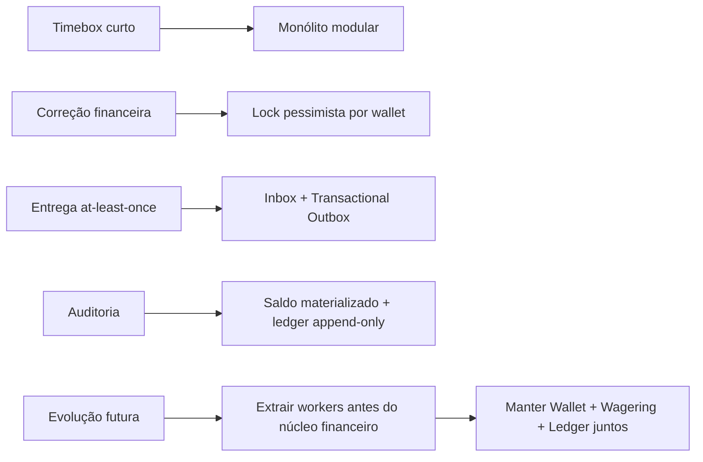

O primeiro caminho de segregação seria executar consumers e publishers como
processos independentes. Eu manteria Wallet, Wagering e Ledger juntos enquanto
precisarem da mesma transação. Reconciliação pode virar serviço separado quando
o volume justificar. Identidade deve ser integrada a um IdP externo.

## 5. Fluxo ponta a ponta

HTTP e SQS chamam o mesmo `WageringService`. Essa decisão evita duas versões da
regra financeira. Na entrada SQS, a Inbox participa da mesma transação do
efeito financeiro. O ACK só acontece depois do commit.

O publisher reivindica um lote curto com `FOR UPDATE SKIP LOCKED` e lease,
libera a transação SQL e só então chama o SQS. Não mantenho lock de banco durante
uma chamada de rede. Se a publicação tiver resultado ambíguo, o mesmo evento
pode ser reenviado; consumidores downstream precisam deduplicar pelo `eventId`.

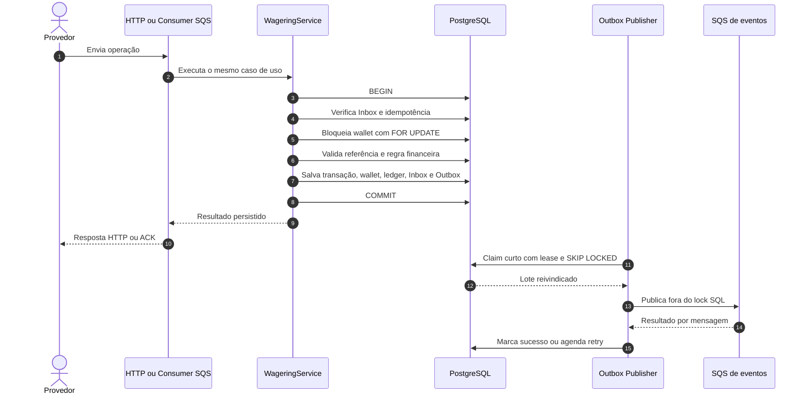

## 6. Dados e invariantes

Dinheiro nunca usa `number`. Recebo e devolvo string decimal, opero com
`decimal.js` e persisto como `numeric(20,2)`. Constraints do banco continuam
protegendo os dados mesmo se um caminho de aplicação tiver um bug.

A idempotência tem camadas diferentes:

- `(consumerName, messageId)` identifica uma entrega para a Inbox;
- `idempotencyKey` identifica a intenção idempotente;
- `(providerId, externalTransactionId)` identifica a operação no provedor;
- `payloadHash` confirma que um replay tem o mesmo conteúdo de negócio;
- constraints únicas decidem corretamente quando instâncias correm entre si.

`gameId` participa do `payloadHash`, mas não da identidade única atual. Portanto,
reutilizar a mesma transação com outro jogo gera conflito, não um novo débito.

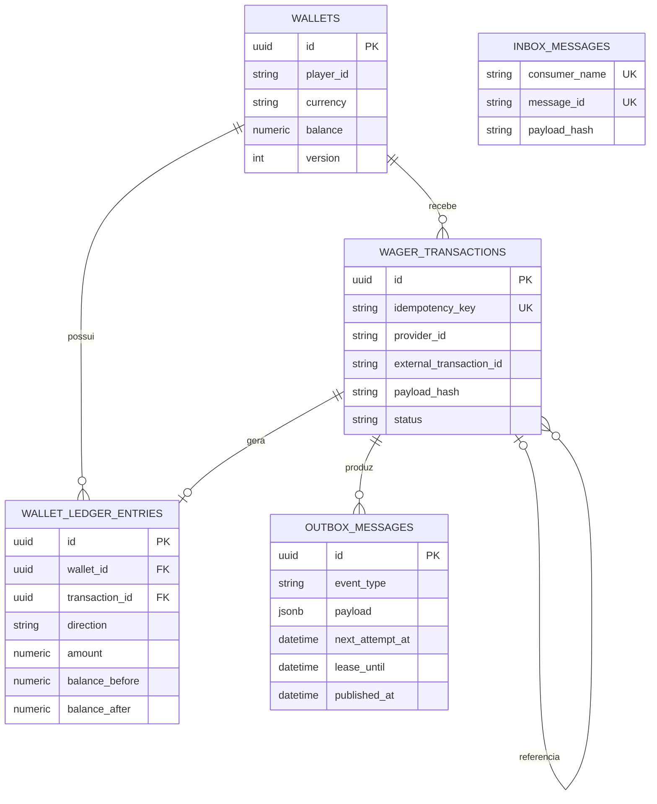

Invariantes principais:

- saldo nunca fica negativo;
- uma wallet é única por jogador e moeda;
- cada movimento de saldo tem exatamente um lançamento correspondente;
- o ledger é append-only, protegido contra `UPDATE` e `DELETE` por trigger;
- `wallet.balance == saldo reconstruído pelo ledger`;
- a mesma referência não pode ser revertida duas vezes pelo mesmo tipo;
- `WIN` pode opcionalmente referenciar uma `BET` da mesma rodada; caso referenciada e ainda não presente, transiciona para `PENDING_REFERENCE`;
- `PROCESSED`, `REJECTED` e `FAILED` são terminais.

## 7. Resiliência e falhas

`MessageGroupId = walletId` reduz reordenação e impede processamento simultâneo
dentro do mesmo grupo. Grupos de wallets diferentes continuam paralelos. A
Inbox não ordena mensagens; ela deduplica entregas. A garantia financeira final
vem das dependências de domínio, da idempotência, dos locks e das constraints.

Se `REFUND`, `ROLLBACK` ou `WIN` com referência chegar antes da transação referenciada,
salvo a operação como `PENDING_REFERENCE`. Um worker com lease, tentativas persistentes
e backoff procura a referência. Se ela chegar, a operação converge; se TTL ou
tentativas acabarem, a rejeição fica auditável.

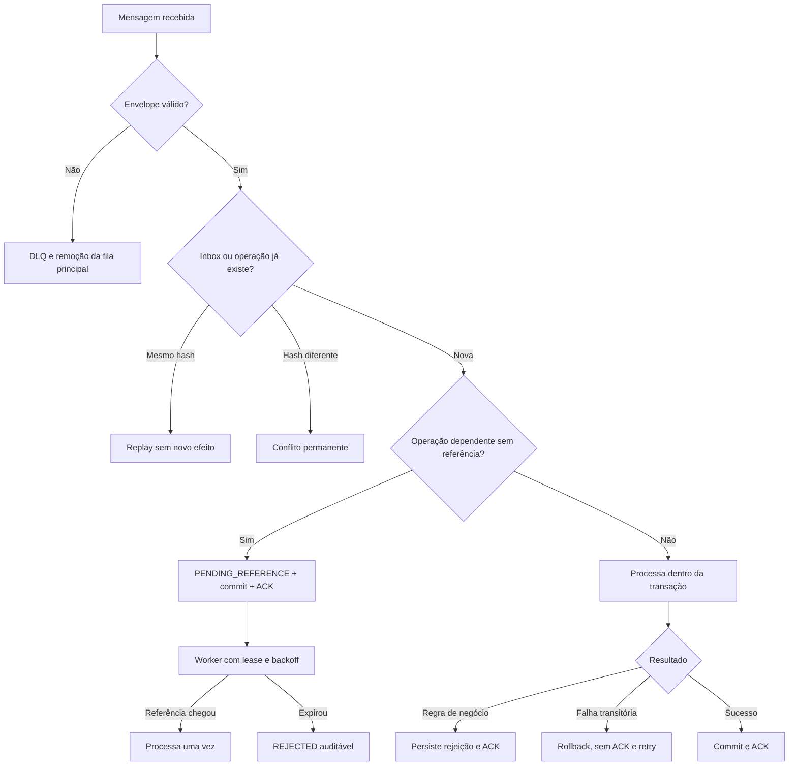

Crashes também têm recuperação explícita: depois do commit e antes do ACK, a
redelivery encontra Inbox/idempotência; depois do commit e antes da publicação,
outra instância encontra a Outbox; depois do envio e antes de marcar publicação,
o contrato `at-least-once` admite duplicação com identidade estável.

Em encerramento gracioso (`SIGTERM`), novos polls de mensagens cessam imediatamente e o consumidor aguarda até `SHUTDOWN_GRACE_PERIOD_MS` para concluir mensagens ativas em voo. Se o prazo expirar com mensagens ainda em execução, a visibilidade de cada mensagem ativa é imediatamente alterada para zero (`VisibilityTimeout: 0`), permitindo que réplicas ativas assumam o processamento sem aguardar a expiração do timeout padrão.

## 8. Escalabilidade e limites comprovados

Eu separo escala total de contenção local. Várias instâncias processam wallets
diferentes em paralelo, mas operações da mesma hot wallet são serializadas por
correção. Essa é uma escolha consciente: escala horizontal entre wallets, não
paralelismo irrestrito dentro de uma wallet.

Cada movimento pode atualizar a wallet e inserir transação, ledger e mensagens
de Outbox; pelo SQS, também insere Inbox. O histórico append-only cresce sempre.
A listagem do ledger usa paginação por cursor e índice composto, mas retenção,
particionamento, arquivamento e reconciliação incremental ainda não foram
necessários nem implementados.

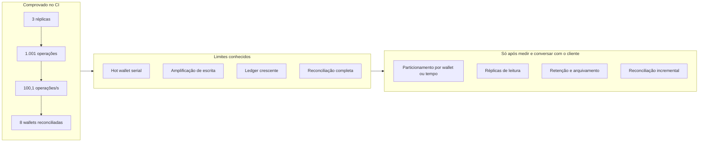

O ensaio teve concorrência 8, aquecimento de 2 segundos e medição de 10
segundos no GitHub Actions. Ele registrou 1.001 operações, 100,1 operações/s e
zero falhas técnicas. Isso **não representa capacidade de produção**, não cria
SLO e não responde quantos usuários o sistema suporta. Volume de usuários,
picos por wallet, escrita, consultas pesadas, retenção e custo precisam ser
tratados com o cliente final.

## 9. Observabilidade e evidências

Eu quis tornar visível o que normalmente fica escondido na mensageria: filas,
pendências, retries, locks, latência, Outbox e reconciliação. O dashboard ajuda
na apresentação dos testes e prepara o terreno para operação em produção.

Essa tela deve exibir sinais operacionais sanitizados, nunca payload financeiro
completo, credenciais ou dados pessoais. Acesso, retenção, mascaramento e
cardinalidade das métricas ainda dependem do ambiente real.

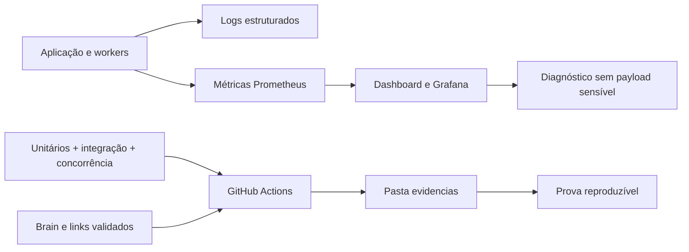

O gate usa testes unitários para regras puras, PostgreSQL e LocalStack reais
para integrações críticas e três instâncias nos cenários concorrentes. A carga
curta é evidência experimental, não promessa. Existe CI automatizado;
**CD ficou fora do escopo**, pois não há ambiente de produção nem estratégia de deploy
definida com o cliente.

OpenTelemetry está instrumentado como base, mas eu não alego tracing distribuído
completo. A fonte das evidências é o código executável, o workflow público e os
relatórios versionados, não apenas números escritos neste arquivo.

## 10. Perguntas para o cliente

Estas perguntas mudam decisões reais e não devem ser respondidas por suposição:

1. **O externalTransactionId é único por provedor ou por jogo?** Hoje assumo
   unicidade por `(providerId, externalTransactionId)`. Se for por jogo, preciso
   alterar constraint, consultas, referências e rota para incluir `gameId`.
2. Quantos usuários, wallets e operações por segundo são esperados? Qual o pico
   por hot wallet?
3. Quais são SLO, latência alvo, RTO e RPO?
4. Por quanto tempo ledger, Inbox, Outbox e transações devem ser retidos?
5. Existe exigência regulatória de partidas dobradas ou contas de contraparte?
6. Qual IdP, protocolo e vínculo entre identidade e `providerId` serão usados?
7. Eventos esgotados continuam recuperáveis na Outbox ou precisam de DLQ
   própria e processo formal de replay?
8. Quem pode acessar dashboards, logs e métricas, e quais campos devem ser
   mascarados?

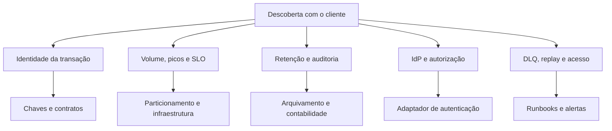

Até essas respostas existirem, prefiro documentar premissas e limites a
inventar capacidade ou complexidade.

## 11. Referências no código

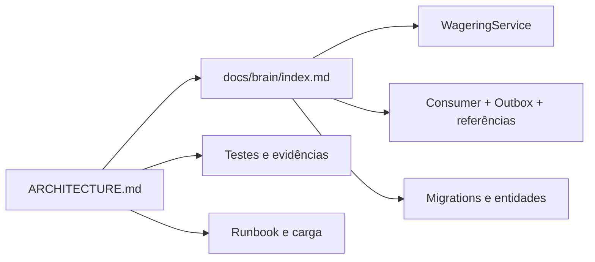

- [Brain e mapa de contratos](docs/brain/index.md)
- [Plano de entrega](docs/DELIVERY_PLAN.md)
- [Regras de apostas](docs/brain/product/WageringRules.md)
- [Concorrência](docs/brain/conventions/Concurrency.md)
- [Idempotência](docs/brain/conventions/Idempotency.md)
- [Transações de banco](docs/brain/conventions/DatabaseTransactions.md)
- [Workers de mensageria](docs/brain/services/MessagingWorkers.md)
- [Serviço financeiro](src/application/wagering/wagering.service.ts)
- [Hash canônico](src/application/wagering/canonical-payload.ts)
- [Consumer SQS](src/infrastructure/messaging/sqs-wager-consumer.ts)
- [Outbox Publisher](src/infrastructure/messaging/outbox-publisher.ts)
- [Worker de referências](src/infrastructure/messaging/pending-reference-worker.ts)
- [Migrations](src/infrastructure/persistence/migrations)
- [Evidências](evidencias/README.md)
- [Relatório de carga](docs/load/short-load-report.md)
- [Operações](docs/runbooks/Operations.md)

O ponto de extensão de autenticação já existe em
`ProviderIdentityPort`/`ProviderIdentityGuard`, mas o adaptador atual
`AllowAllProviderIdentity` autoriza todas as requisições e
**não oferece autenticação efetiva**. Health checks permanecem públicos. Em produção, esse
adaptador deve ser substituído por integração com IdP externo e autorização do
`providerId` antes do caso de uso financeiro.
