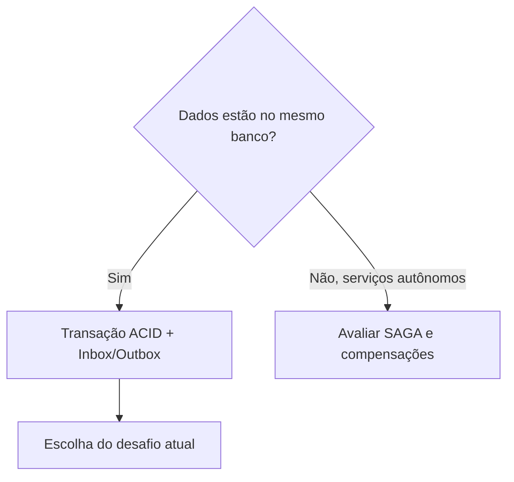
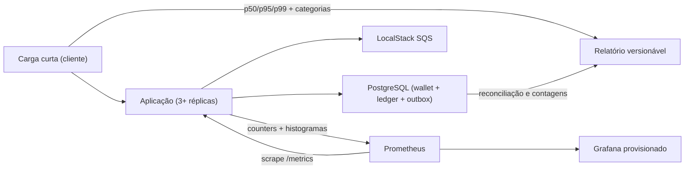

# Arquitetura

## Estilo

Monólito modular NestJS com DDD pragmático e arquitetura hexagonal. `domain` não depende de NestJS, ORM ou AWS; `application` coordena portas; adaptadores ficam em `infrastructure` e `interfaces`.

## Decisões principais

- **MikroORM:** escolhido pelo Unit of Work, transações explícitas e suporte a locks.
- **Money:** `decimal.js` no domínio, string decimal nos contratos e `numeric(20,2)` no PostgreSQL. Nunca converter para `number`.
- **Concorrência:** transação SQL com lock pessimista por linha da wallet (`SELECT ... FOR UPDATE`). Locks de wallets distintas não se bloqueiam.
- **Idempotência:** unicidade persistente de `idempotency_key` e de `(provider_id, external_transaction_id)`, com `payload_hash` SHA-256 de JSON canônico.
- **Atomicidade:** transação financeira, ledger, inbox e outbox são confirmados juntos.
- **Entrega:** SQS FIFO melhora ordenação por `walletId`, mas PostgreSQL continua sendo a fonte das garantias.
- **Outbox:** publishers concorrentes reivindicam lotes com `FOR UPDATE SKIP LOCKED`; publicar é pelo menos uma vez e consumidores devem deduplicar.
- **Referências fora de ordem:** estado `PENDING_REFERENCE`, worker com backoff exponencial, limite de tentativas e rejeição auditável ao expirar.
- **Autenticação:** deliberadamente fora do primeiro timebox. Não há validação de credenciais nem proteção efetiva de acesso nesta versão. Um guard global delega ao `ProviderIdentityPort`, cujo adaptador atual (`AllowAllProviderIdentity`) autoriza toda requisição; health checks ignoram essa porta por serem explicitamente públicos.

## Extensão de identidade e autenticação

O desenho futuro mantém os controllers independentes do mecanismo de autenticação. O `ProviderIdentityGuard` coleta a credencial do canal e o `providerId` declarado na rota ou no payload, então delega a decisão ao `ProviderIdentityPort`. Hoje o adaptador allow-all preserva o comportamento sem autenticação.

Para habilitar segurança, substitui-se apenas esse provider por um adaptador que valide a credencial (por exemplo, JWT, API key ou introspecção externa) e confirme que a identidade autenticada pode agir pelo `providerId` declarado. Requisições ausentes, inválidas ou com identidade divergente deverão ser rejeitadas antes do caso de uso; `/health/live` e `/health/ready` continuam fora dessa decisão. O contrato não escolhe antecipadamente protocolo, emissor nem formato de token.

## Consistência distribuída e decisão sobre SAGA

SAGA não foi adotada porque todas as alterações financeiras — transação, wallet, ledger, inbox e outbox — pertencem ao mesmo limite transacional PostgreSQL e são confirmadas atomicamente. A comunicação com o SQS utiliza Transactional Inbox/Outbox, idempotência persistente e entrega `at-least-once`.

Uma SAGA seria considerada somente se o domínio fosse dividido futuramente entre serviços autônomos com bancos independentes, exigindo etapas e compensações próprias. `REFUND` e `ROLLBACK` permanecem operações financeiras do domínio e não são compensações técnicas de uma SAGA.

## Limites transacionais

`ProcessWagerTransaction` abre uma transação, resolve a idempotência, bloqueia a wallet, valida a referência, aplica a transição, insere ledger quando necessário, cria eventos na outbox e registra a inbox quando a origem é SQS. O ack acontece somente depois do commit.

Consultas e reconciliação não alteram lançamentos. Divergências são retornadas, logadas e contabilizadas, nunca corrigidas silenciosamente.

## Modelo de dados mínimo

- `wallets`: unique `(player_id, currency)`, `balance >= 0`, `version >= 1`.
- `wager_transactions`: unique `idempotency_key`; unique `(provider_id, external_transaction_id)`; status e failure code auditáveis.
- `wallet_ledger_entries`: unique `(wallet_id, transaction_id)`; append-only; valores e saldos não negativos.
- `inbox_messages`: primary/unique `(consumer_name, message_id)`.
- `outbox_messages`: índice parcial por pendência e `next_attempt_at`.
- restrições de reversão impedem mais de um `REFUND` ou `ROLLBACK` do mesmo tipo por referência.

## Falhas e consistência

- erro de negócio: terminal, persiste rejeição/evento e faz ack;
- indisponibilidade transitória: rollback, sem ack, retry com backoff;
- erro permanente de infraestrutura/payload: registra quando seguro e encaminha à DLQ após o limite;
- crash após commit e antes do ack: redelivery encontra inbox/idempotência e não reaplica efeito;
- crash após commit e antes da publicação: outro publisher encontra a outbox pendente.

## Trade-offs

O lock pessimista simplifica a prova de correção e favorece o desafio, ao custo de serializar operações da mesma wallet. A solução evita microserviços, Kafka, cache distribuído e autenticação completa para manter o foco no núcleo financeiro. Partidas dobradas e OpenTelemetry completo permanecem diferenciais posteriores.

## Medição da carga curta

A carga mede a API a partir do cliente enquanto o Prometheus coleta sinais
internos das réplicas. A latência financeira é um histograma cumulativo; o
Grafana calcula p50/p95/p99 com `histogram_quantile`, em vez de tratar o último
valor observado como distribuição. Throughput não possui gate mínimo: erro
técnico e quebra de invariante falham o ensaio, desempenho apenas é reportado.

