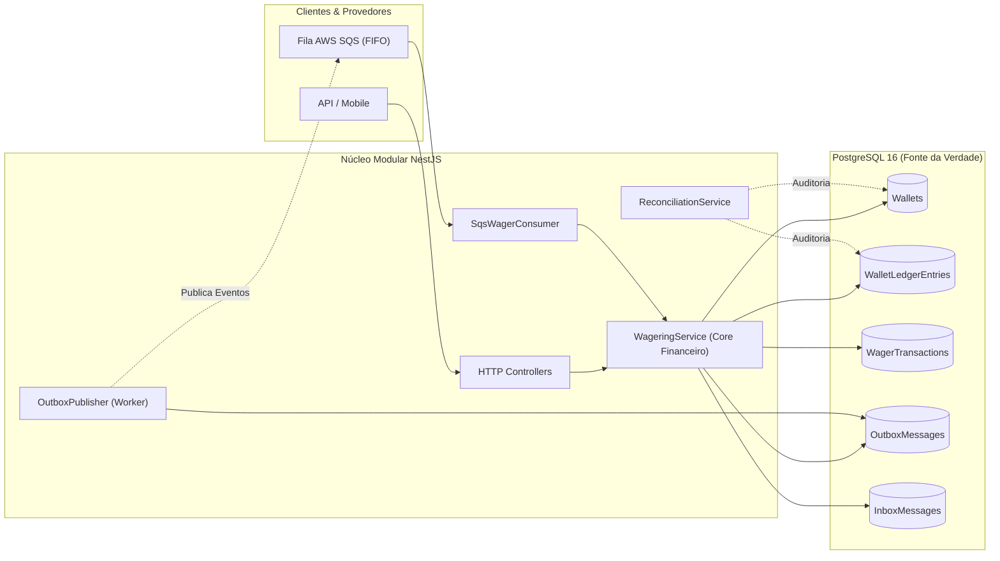
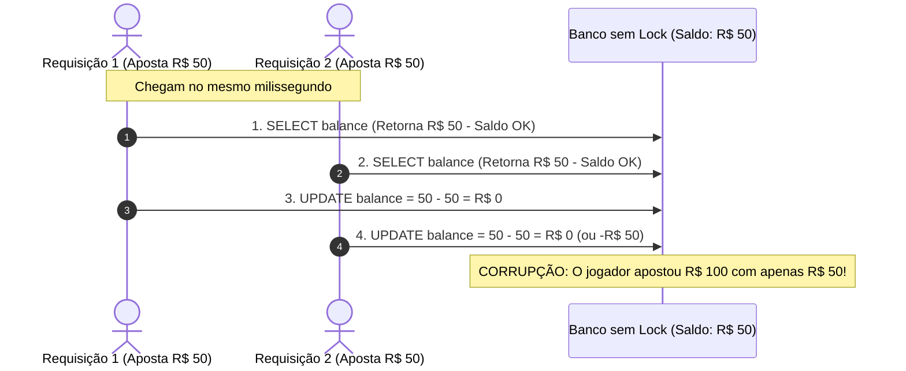
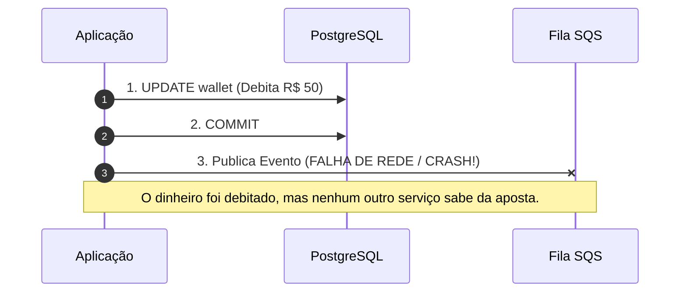
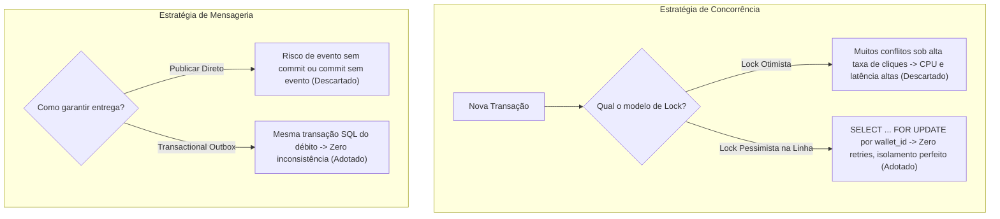
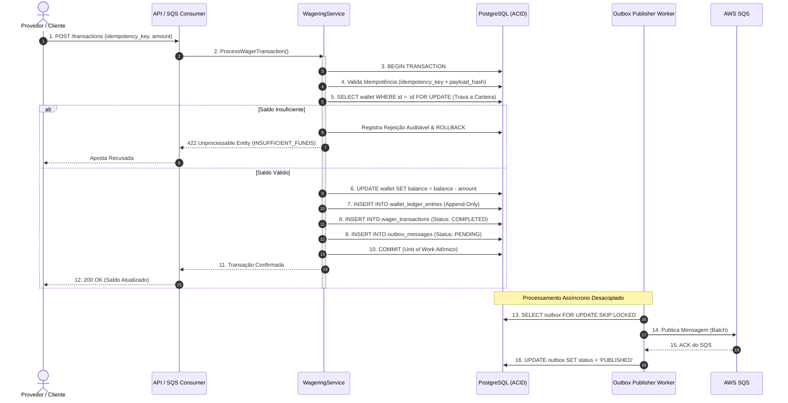
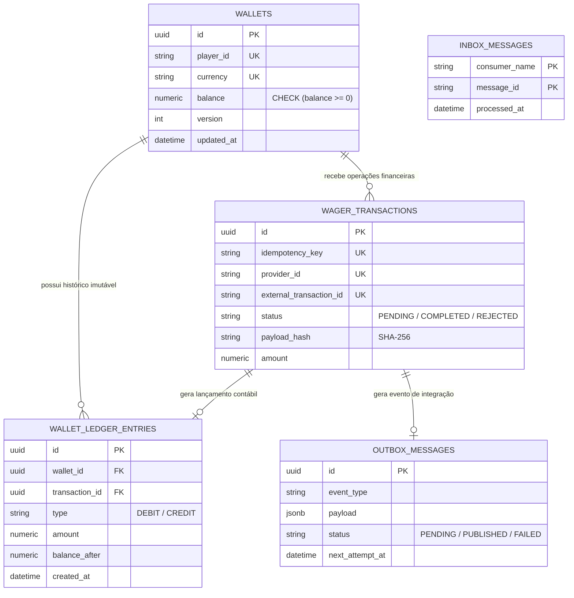
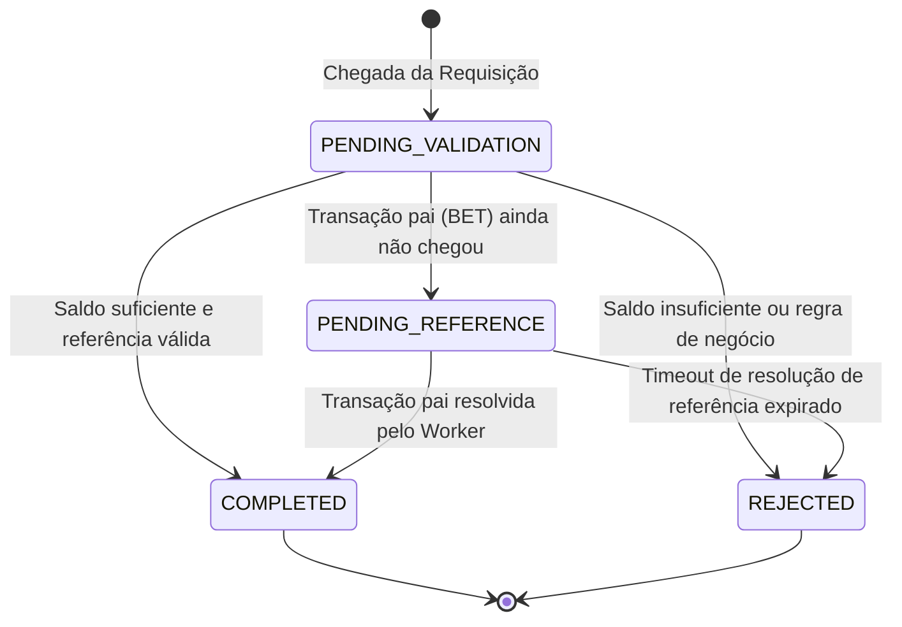
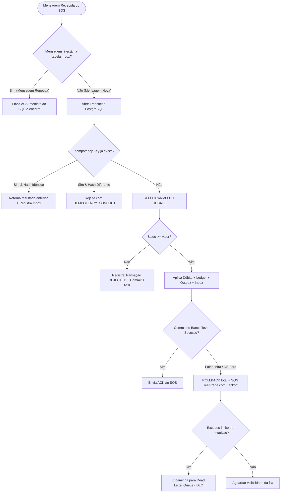

# Arquitetura: Distributed Wagering Processor

> **Resumo**: Motor transacional financeiro para processamento concorrente de apostas e prêmios com garantia estrita de consistência monetária, idempotência de ponta a ponta e persistência transacional de mensageria (Outbox/Inbox).

---

## 1. Visão Geral & Escopo do Sistema

O sistema gerencia carteiras de jogadores e executa débitos (apostas), créditos (vitórias/reembolsos) e reconciliação contínua, unificando entradas síncronas (HTTP) e assíncronas (SQS).

---

## 2. Contexto do Problema: O que Acontece Sem Esse Design?

Sem os mecanismos de lock pessimista por linha e outbox transacional, dois problemas críticos de sistemas financeiros ocorrem:

### A. Condição de Corrida (Gasto Duplo)

### B. Dual-Write Inconsistente (Mensageria Desconectada do Banco)

---

## 3. Decisões de Arquitetura & Trade-offs

| Decisão Adotada | Alternativa Rejeitada | Justificativa / Trade-off |
| :--- | :--- | :--- |
| **Lock Pessimista no SQL (`FOR UPDATE` por Wallet)** | Lock Otimista (`version++`) | O lock pessimista serializa transações da **mesma carteira**, evitando overhead de retries em alta contenção. Carteiras distintas executam 100% paralelas. |
| **Transactional Outbox & Inbox** | Publicação direta no SQS durante o request | Garante atomicidade Dual-Write: a mensagem só é enviada se a transação do banco for commitada com sucesso. |
| **Ledger Append-Only (Livro-Razão)** | Apenas atualizar a coluna `balance` | Permite rastreabilidade contábil imutável e reconciliação matemática: `wallet.balance == SUM(ledger)`. |
| **Precisão `decimal.js` + `numeric(20,2)`** | Tipos `number` / `float` IEEE 754 | Elimina risco de dízimas periódicas e perda de centavos em operações aritméticas. |

---

## 4. Fluxo Visual de Execução Ponta a Ponta

---

## 5. Modelo de Dados & Ciclo de Vida das Entidades

### A. Modelo Entidade-Relacionamento

### B. Máquina de Estados da Transação

---

## 6. Resiliência e Árvore de Decisão de Falhas

---

## 7. Referências e Arquivos do Projeto

- [ARCHITECTURE.md](ARCHITECTURE.md) — Diretrizes arquiteturais gerais.
- [docs/brain/index.md](docs/brain/index.md) — Índice de contratos e invariantes do sistema.
- [docs/brain/conventions/Concurrency.md](docs/brain/conventions/Concurrency.md) — Estratégia de concorrência e isolamento.
- [docs/brain/conventions/Idempotency.md](docs/brain/conventions/Idempotency.md) — Padrão de idempotência e hash canônico.
- [docs/brain/services/MessagingWorkers.md](docs/brain/services/MessagingWorkers.md) — Especificação dos workers de fila e outbox.
- [docs/DELIVERY_PLAN.md](docs/DELIVERY_PLAN.md) — Fases de entrega e critérios de aceite.
