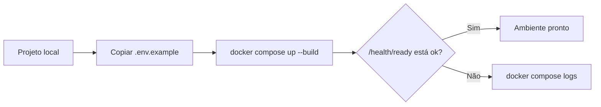
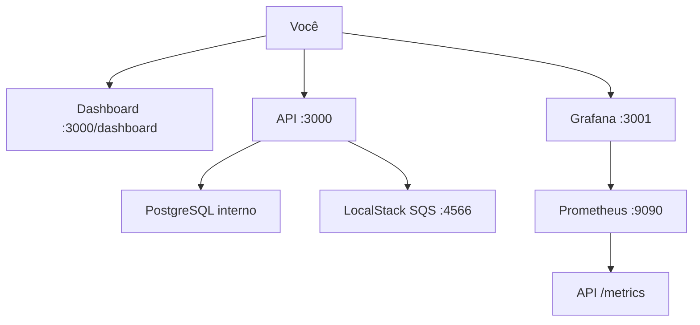
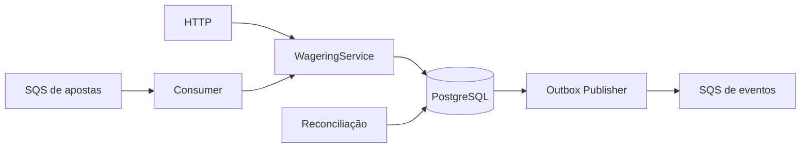
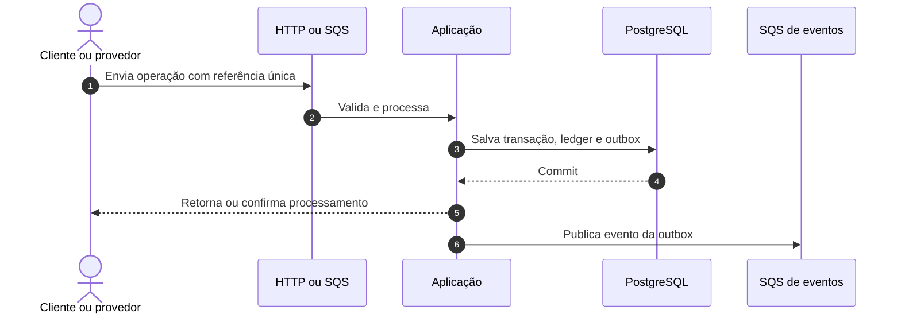
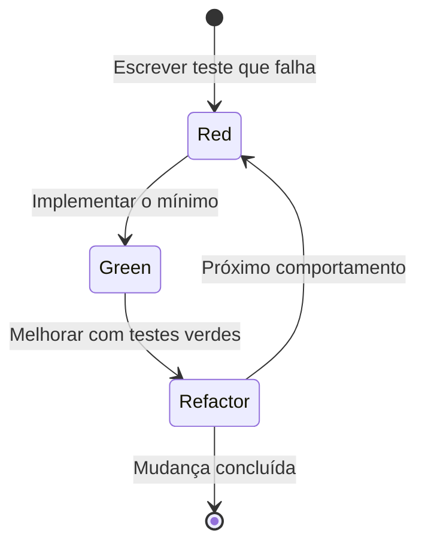
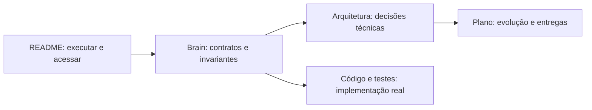

# Distributed Wagering Processor

Serviço financeiro distribuído para processar apostas com consistência, idempotência e rastreabilidade.

## 1. Monte o ambiente

Você precisa apenas do **Docker Desktop com Compose v2**. O Bun já está na imagem da aplicação.

```sh
cp .env.example .env
docker compose up --build
```

Espere os serviços ficarem saudáveis e valide:

```sh
curl http://localhost:3000/health/live
curl http://localhost:3000/health/ready
```



Para encerrar, use `docker compose down`. Para também apagar os dados locais do PostgreSQL, use `docker compose down -v`.

## 2. Acesse o ambiente

| O que | Endereço | Como usar |
|---|---|---|
| Dashboard da aplicação | <http://localhost:3000/dashboard> | Visão rápida da saúde e operação |
| API HTTP | <http://localhost:3000> | Wallets e transações de apostas |
| Health | <http://localhost:3000/health/ready> | Confirma PostgreSQL e SQS |
| Métricas | <http://localhost:3000/metrics> | Formato Prometheus ou JSON via `Accept` |
| Grafana | <http://localhost:3001> | Login local `admin` / `admin` |
| Prometheus | <http://localhost:9090> | Consultas e targets de métricas |
| LocalStack | <http://localhost:4566> | Emulação local do AWS SQS |

As credenciais `test` da AWS e `admin/admin` do Grafana são exclusivas do ambiente local.



## 3. Entenda o que temos

O sistema recebe operações por HTTP ou SQS, aplica a regra financeira uma única vez e registra saldo, ledger e evento na mesma transação do PostgreSQL.



| Parte | Responsabilidade | Onde entender |
|---|---|---|
| Domínio | Dinheiro, carteira, transação e ledger | [`src/domain`](src/domain), [Brain](docs/brain/index.md) |
| Aplicação | Casos de uso financeiros | [`src/application`](src/application) |
| Infraestrutura | PostgreSQL, SQS, workers e métricas | [`src/infrastructure`](src/infrastructure) |
| Interface HTTP | Endpoints, DTOs e health checks | [`src/interfaces/http`](src/interfaces/http) |
| Testes | Unidade, integração e concorrência | [`tests`](tests) |

Stack: Bun 1.1.38, TypeScript, NestJS, PostgreSQL 16, MikroORM, SQS FIFO via LocalStack, Prometheus e Grafana.

## 4. Use a API e as filas

Os contratos completos estão em [HttpApi](docs/brain/resources/HttpApi.md) e [SqsMessages](docs/brain/resources/SqsMessages.md).



Endpoints principais:

- `POST /wallets` e `GET /wallets/:walletId`;
- `GET /wallets/:walletId/ledger`;
- `POST /wagering/transactions`;
- `GET /wagering/transactions/:transactionId`;
- `GET /providers/:providerId/wagering/transactions/:externalTransactionId`.

Para inspecionar as filas sem instalar ferramentas no host:

```sh
docker compose exec localstack awslocal sqs list-queues
```

Filas criadas no bootstrap:

- `wager-transactions.fifo` — entrada de operações;
- `wager-transactions-dlq.fifo` — mensagens que excederam as tentativas;
- `wager-events.fifo` — eventos produzidos pela aplicação.

## 5. Desenvolva e valide

Toda mudança segue **Red → Green → Refactor**. Consulte [Testing](docs/brain/conventions/Testing.md) antes de alterar contratos.



Com Bun instalado localmente:

```sh
bun install
bun run check
bun run test:integration
bun run test:concurrency
bun run migration:fresh
```

O gate completo é `bun run hardening`. O roteiro para três instâncias está em [Hardening](docs/HARDENING.md).

## 6. Aprofunde-se

Comece pelo Brain e avance somente até o nível necessário para sua tarefa.



- [Brain](docs/brain/index.md) — mapa do domínio, contratos e invariantes;
- [Arquitetura](ARCHITECTURE.md) — decisões e limites do sistema;
- [Plano de entrega](docs/DELIVERY_PLAN.md) — fases e critérios;
- [Entenda](Entenda.md) — explicação visual aprofundada;
- [Operações](docs/runbooks/Operations.md) — diagnóstico e recuperação.

Invariantes centrais: dinheiro não usa ponto flutuante; saldo não fica negativo; cada mudança de saldo gera um lançamento imutável; reentregas não duplicam efeitos; eventos só ficam publicáveis após o commit financeiro.
