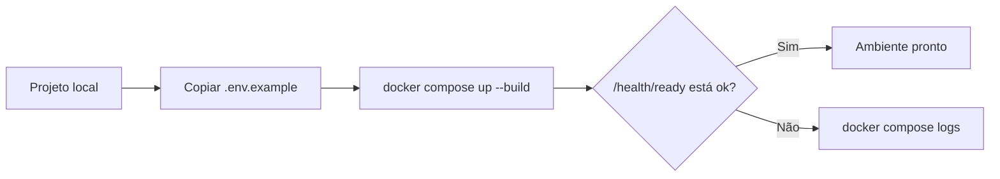
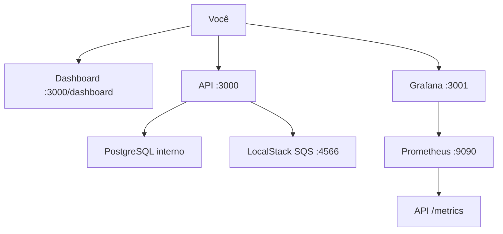
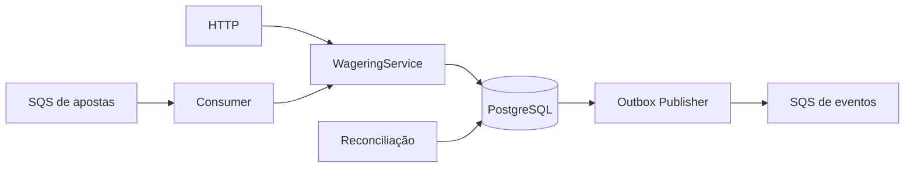
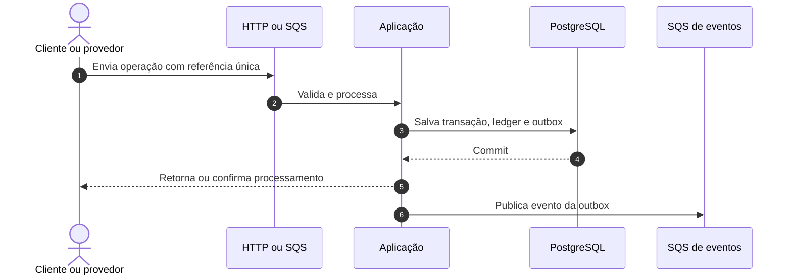
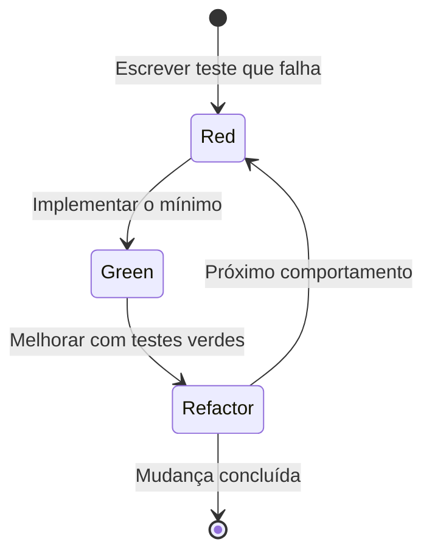
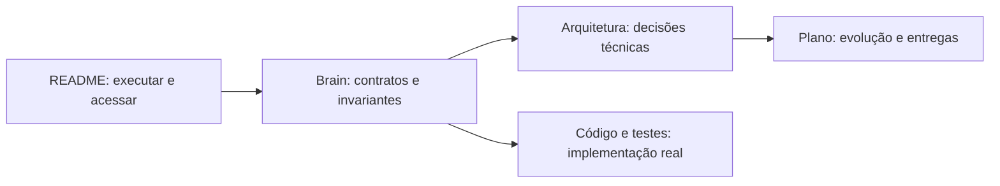
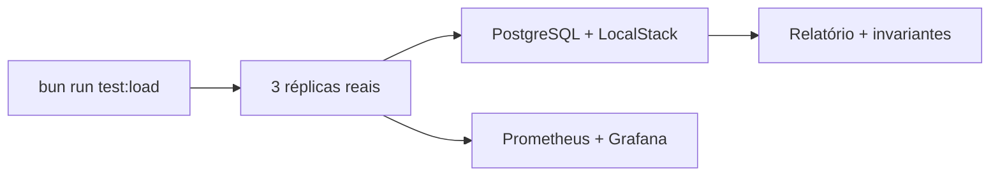
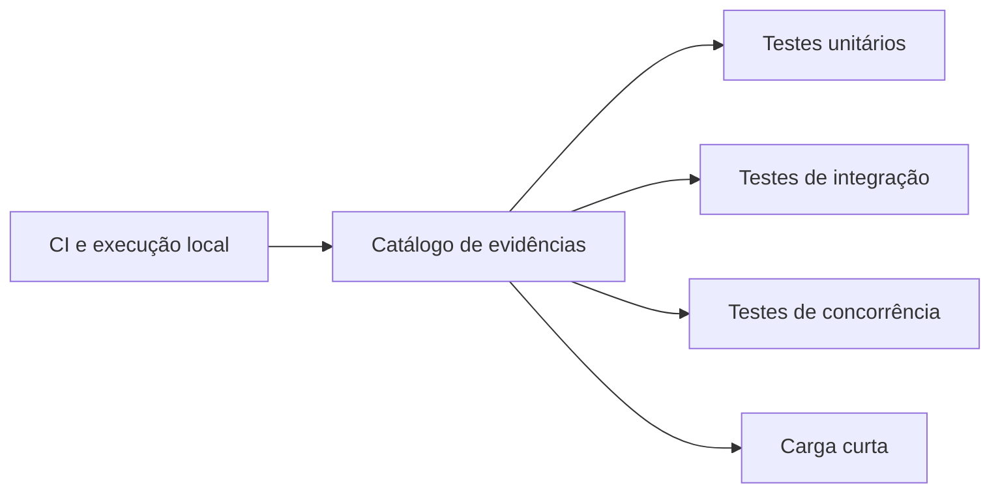

# Distributed Wagering Processor

Serviço financeiro distribuído para processar apostas com consistência, idempotência e rastreabilidade.

## 1. Monte o ambiente

Você precisa apenas do **Docker Desktop com Compose v2**. O Bun já está na imagem da aplicação.

```sh
cp .env.example .env
docker compose up --build
```

Espere os serviços ficarem saudáveis e valide:

```sh
curl http://localhost:3000/health/live
curl http://localhost:3000/health/ready
```



Para encerrar, use `docker compose down`. Para também apagar os dados locais do PostgreSQL, use `docker compose down -v`.

## 2. Acesse o ambiente

| O que | Endereço | Como usar |
|---|---|---|
| Dashboard da aplicação | <http://localhost:3000/dashboard> | Visão rápida da saúde e operação |
| API HTTP | <http://localhost:3000> | Wallets e transações de apostas |
| Health | <http://localhost:3000/health/ready> | Confirma PostgreSQL e SQS |
| Métricas | <http://localhost:3000/metrics> | Formato Prometheus ou JSON via `Accept` |
| Grafana | <http://localhost:3001> | Login local `admin` / `admin` |
| Prometheus | <http://localhost:9090> | Consultas e targets de métricas |
| LocalStack | <http://localhost:4566> | Emulação local do AWS SQS |

As credenciais `test` da AWS e `admin/admin` do Grafana são exclusivas do ambiente local.



## 3. Entenda o que temos

O sistema recebe operações por HTTP ou SQS, aplica a regra financeira uma única vez e registra saldo, ledger e evento na mesma transação do PostgreSQL.



| Parte | Responsabilidade | Onde entender |
|---|---|---|
| Domínio | Dinheiro, carteira, transação e ledger | [`src/domain`](src/domain), [Brain](docs/brain/index.md) |
| Aplicação | Casos de uso financeiros | [`src/application`](src/application) |
| Infraestrutura | PostgreSQL, SQS, workers e métricas | [`src/infrastructure`](src/infrastructure) |
| Interface HTTP | Endpoints, DTOs e health checks | [`src/interfaces/http`](src/interfaces/http) |
| Testes | Unidade, integração e concorrência | [`tests`](tests) |

Stack: Bun 1.1.38, TypeScript, NestJS, PostgreSQL 16, MikroORM, SQS FIFO via LocalStack, Prometheus e Grafana.

## 4. Use a API e as filas

Os contratos completos estão em [HttpApi](docs/brain/resources/HttpApi.md) e [SqsMessages](docs/brain/resources/SqsMessages.md).



Endpoints principais:

- `POST /wallets` e `GET /wallets/:walletId`;
- `GET /wallets/:walletId/ledger`;
- `POST /wagering/transactions`;
- `GET /wagering/transactions/:transactionId`;
- `GET /providers/:providerId/wagering/transactions/:externalTransactionId`.

Para inspecionar as filas sem instalar ferramentas no host:

```sh
docker compose exec localstack awslocal sqs list-queues
```

Filas criadas no bootstrap:

- `wager-transactions.fifo` — entrada de operações;
- `wager-transactions-dlq.fifo` — mensagens que excederam as tentativas;
- `wager-events.fifo` — eventos produzidos pela aplicação.

## 5. Desenvolva e valide

Toda mudança segue **Red → Green → Refactor**. Consulte [Testing](docs/brain/conventions/Testing.md) antes de alterar contratos.



Com Bun instalado localmente:

```sh
bun install
bun run check
bun run test:integration
bun run test:concurrency
bun run migration:fresh
```

O gate completo é `bun run hardening`. O roteiro para três instâncias está em [Hardening](docs/HARDENING.md).

## 6. Aprofunde-se

Comece pelo Brain e avance somente até o nível necessário para sua tarefa.



- [Brain](docs/brain/index.md) — mapa do domínio, contratos e invariantes;
- [Arquitetura](ARCHITECTURE.md) — decisões e limites do sistema;
- [Plano de entrega](docs/DELIVERY_PLAN.md) — fases e critérios;
- [Entenda](Entenda.md) — explicação visual aprofundada;
- [Operações](docs/runbooks/Operations.md) — diagnóstico e recuperação.

Invariantes centrais: dinheiro não usa ponto flutuante; saldo não fica negativo; cada mudança de saldo gera um lançamento imutável; reentregas não duplicam efeitos; eventos só ficam publicáveis após o commit financeiro.

## 7. Evidências verificáveis da entrega

[](https://github.com/renansko/jugle-gaming-test/actions/workflows/ci.yml)

O workflow de CI repete o gate em uma máquina limpa do GitHub: instala as
dependências, valida lint e TypeScript, executa migrations reversíveis, sobe
PostgreSQL e LocalStack, mantém três réplicas da aplicação e roda o hardening.

| Evidência | Resultado comprovado |
|---|---|
| Testes unitários | 79 aprovados |
| Testes de integração | 19 aprovados |
| Testes de concorrência | 4 aprovados |
| Total do gate automatizado | 102 testes aprovados |
| Instâncias simultâneas | 3 réplicas saudáveis |
| Migrations | `up → down → up` desde banco vazio |
| Índices críticos | 4 verificados por plano de execução |
| Documentação do Brain | 23 links internos validados |

As provas ficam disponíveis no [histórico público do CI](https://github.com/renansko/jugle-gaming-test/actions/workflows/ci.yml),
no [roteiro reproduzível de hardening](docs/HARDENING.md) e nos próprios
[testes](tests). Esta apresentação responde às lacunas levantadas no
[benchmark público da issue #12](https://github.com/renansko/jugle-gaming-test/issues/12)
sem transformar quantidade de arquivos ou testes em nota de qualidade.

> Este repositório possui CI automatizado. Deploy contínuo não está configurado,
> pois o escopo atual valida a aplicação localmente com Docker e não publica em
> um ambiente de produção.

## 8. Métricas e observabilidade

Com o ambiente em execução, as métricas podem ser consultadas diretamente em
[`GET /metrics`](http://localhost:3000/metrics), no
[dashboard da aplicação](http://localhost:3000/dashboard), no
[Prometheus](http://localhost:9090) e no [Grafana](http://localhost:3001).

| Métrica | O que evidencia |
|---|---|
| `wager_transactions_total` | Operações por tipo, status e código de falha |
| `wager_processing_latency_ms` | Latência de processamento por canal |
| `wallet_lock_duration_ms` | Tempo de contenção do lock financeiro |
| `outbox_pending` | Eventos ainda aguardando publicação |
| `outbox_lag_ms` | Idade do evento mais antigo pendente |
| `reconciliation_divergences_total` | Diferenças detectadas entre saldo e ledger |

O CI comprova que essas séries são expostas e que os cenários funcionais
permanecem verdes. Throughput e p50/p95/p99 ainda não foram medidos; esses
números exigem um ensaio de carga controlado e não são inferidos da suíte
funcional.

## 9. Carga curta reproduzível



Em uma stack limpa, execute:

```bash
docker compose -f compose.yaml -f compose.hardening.yaml -f compose.load.yaml up -d --build --wait postgres localstack
docker compose -f compose.yaml -f compose.hardening.yaml -f compose.load.yaml run --rm app bun run migration:up
docker compose -f compose.yaml -f compose.hardening.yaml -f compose.load.yaml up -d --scale app=3 app prometheus grafana
docker compose -f compose.yaml -f compose.hardening.yaml -f compose.load.yaml run --rm --no-deps test bun run test:load
```

O perfil padrão aquece por 2 s e mede 10 s com concorrência 8. A execução
versionada obteve 128,4 operações/s, p50 de 61,78 ms, p95 de 106,37 ms e p99
de 127,06 ms, sem falha técnica. A outbox chegou a 1.418 pendências e convergiu
a zero; oito wallets reconciliaram saldo e ledger. Não existe gate mínimo de
RPS: desempenho é reportado, enquanto erro técnico ou quebra de invariante
falha o comando.

Veja o [relatório completo](docs/load/short-load-report.md), o
[job público de CI](https://github.com/renansko/jugle-gaming-test/actions/workflows/ci.yml),
o [Grafana local](http://localhost:3001) e o contexto das issues
[#11](https://github.com/renansko/jugle-gaming-test/issues/11) e
[#12](https://github.com/renansko/jugle-gaming-test/issues/12). Os resultados
são locais, curtos e dependentes do host; não equivalem a um SLO de produção.

## 10. Evidências dos testes da issue #13



As evidências públicas referentes à
[issue #13](https://github.com/renansko/jugle-gaming-test/issues/13) estão
organizadas por tipo de validação:

- [Catálogo e critérios de leitura](evidencias/README.md);
- [testes unitários](evidencias/testes-unitarios.md);
- [testes de integração](evidencias/testes-integracao.md);
- [testes de concorrência](evidencias/testes-concorrencia.md);
- [carga curta e invariantes finais](evidencias/carga-curta.md).

Os arquivos registram comandos reproduzíveis, resultados observados, limites e
links para as fontes. O histórico público do CI continua sendo a fonte para
execuções em máquinas limpas; números versionados não representam um SLO.
