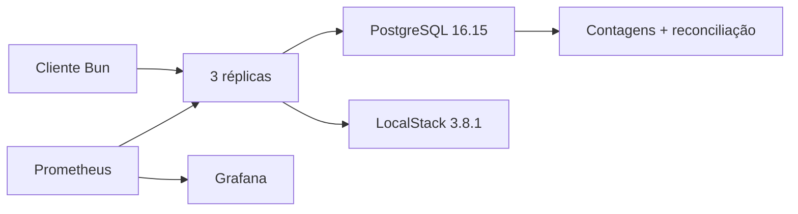

# Relatório de carga curta no GitHub Actions

Commit: `089ef3014adfd45a796f9a2202c8f1b837d4efcd`

Execução: [GitHub Actions 33703096311](https://github.com/renansko/jugle-gaming-test/actions/runs/33703096311)
Exit code: `0`

## Ambiente e método

- Linux Azure `6.17.0-1022-azure`, 2 CPUs AMD EPYC 7763 64-Core e 8,32 GB de RAM;
- Bun 1.1.38 e Docker 28.0.4;
- aquecimento de 2 s, medição de 10 s e concorrência 8;
- massa isolada `load-2026-09-03T01-19-52-421Z-40a71865`;
- mistura: BETs aceitas, saldo insuficiente, replay exato e conflito idempotente;
- término por duração; falha técnica, divergência ou outbox não convergente falha o job;
- nenhuma meta mínima de RPS.

## Resultado do cliente

| operações | ops/s | p50 | p95 | p99 | sucesso | rejeição | conflito | falha técnica |
|---:|---:|---:|---:|---:|---:|---:|---:|---:|
| 1.398 | 139,8 | 49,54 ms | 120,45 ms | 180,99 ms | 1.020 | 127 | 251 | 0 |

## Sinais internos e invariantes

- pico de `outbox_pending`: 1.605; valor final: 0; `outbox_lag_ms` final: 0;
- 1.398 transações da massa, sendo 1.258 processadas e 140 rejeitadas;
- 1.266 lançamentos de ledger e 2.656 eventos de outbox, iguais às fórmulas esperadas;
- `inbox_messages = 0`, esperado porque esta carga usa o canal HTTP;
- oito wallets reconciliadas com `wallet.balance == saldo reconstruído pelo ledger`.

As latências e o throughput acima são do cliente. As séries do Prometheus são
internas à aplicação e aparecem no dashboard provisionado do Grafana. O ensaio
é curto, local e sensível à contenção do host; não representa capacidade de
produção nem estabelece um SLO.
