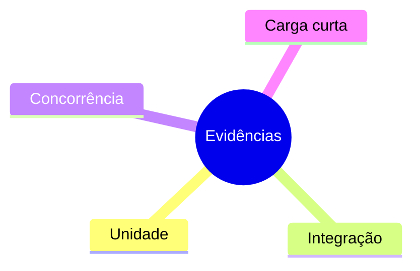
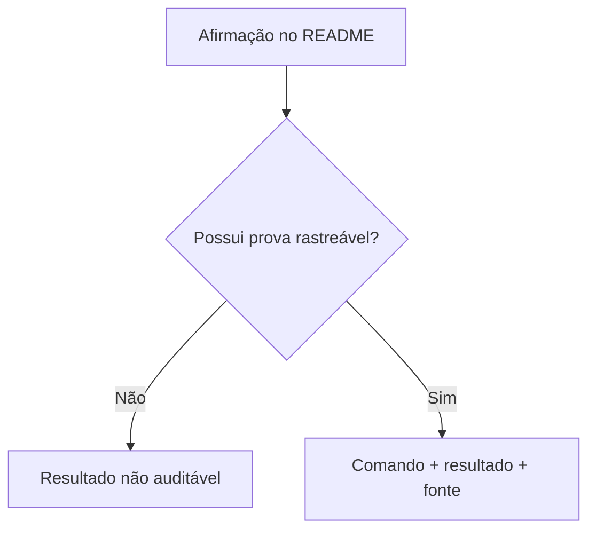
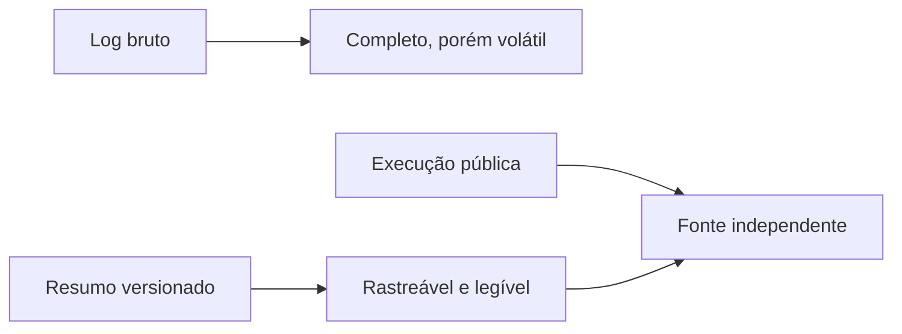
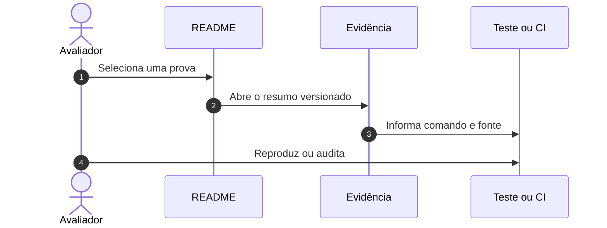
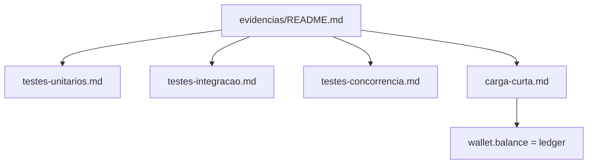
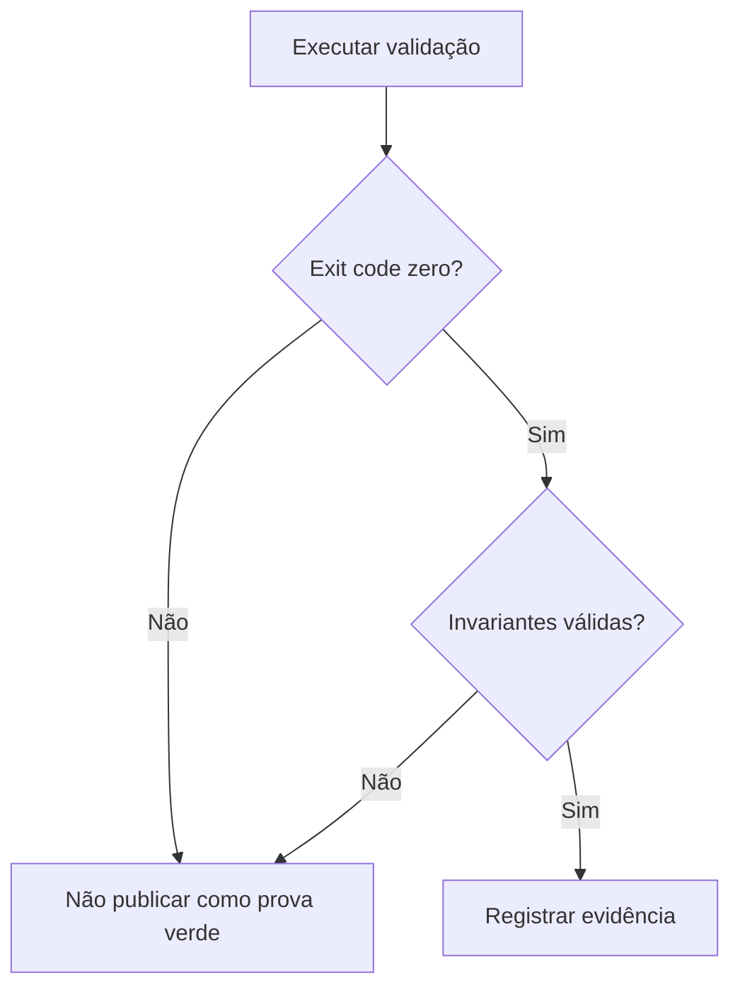
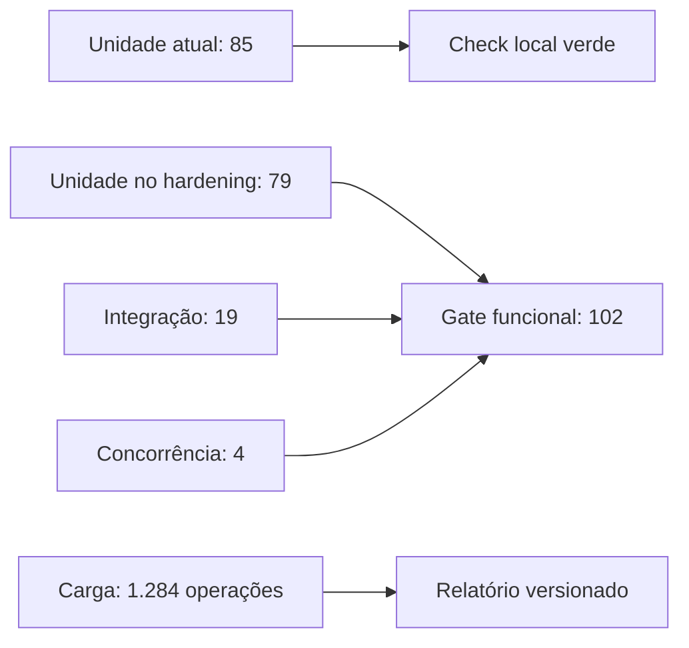

# Catálogo de evidências — issue #13

## Visão geral e objetivo

Este catálogo liga cada afirmação verificável da issue #13 ao comando, ao
resultado registrado e à fonte que permite reproduzi-la.

## Contexto do problema

Uma contagem isolada não demonstra comportamento. A evidência precisa separar
suítes funcionais, concorrência e desempenho, além de declarar limitações.

## Decisões e trade-offs

Os resumos Markdown preservam resultados estáveis; o CI é a autoridade para a
execução pública. Artefatos temporários de runtime não são versionados.

## Fluxo ponta a ponta

## Estrutura e invariantes

Cada arquivo contém escopo, comando, resultado, interpretação e limitações.
Resultados de carga nunca são promovidos a meta mínima de RPS.

## Resiliência e falhas

Uma execução falha por erro técnico ou quebra de invariante, não por throughput
abaixo de um valor arbitrário.

## Evidência verificável

| Evidência | Resultado versionado |
|---|---|
| [Testes unitários](testes-unitarios.md) | 85 aprovados no check local; 79 no hardening registrado |
| [Testes de integração](testes-integracao.md) | 19 aprovados |
| [Testes de concorrência](testes-concorrencia.md) | 4 aprovados em três réplicas |
| [Carga curta](carga-curta.md) | 1.284 operações; invariantes válidas |

## Referências no código

- [Suítes de testes](../tests)
- [Workflow de CI](../.github/workflows/ci.yml)
- [Relatório de carga](../docs/load/short-load-report.md)
- [Issue #13](https://github.com/renansko/jugle-gaming-test/issues/13)
