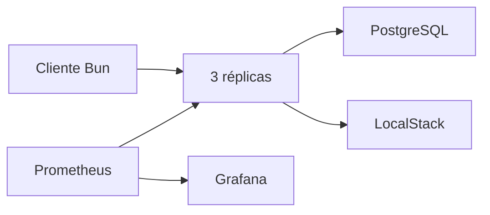
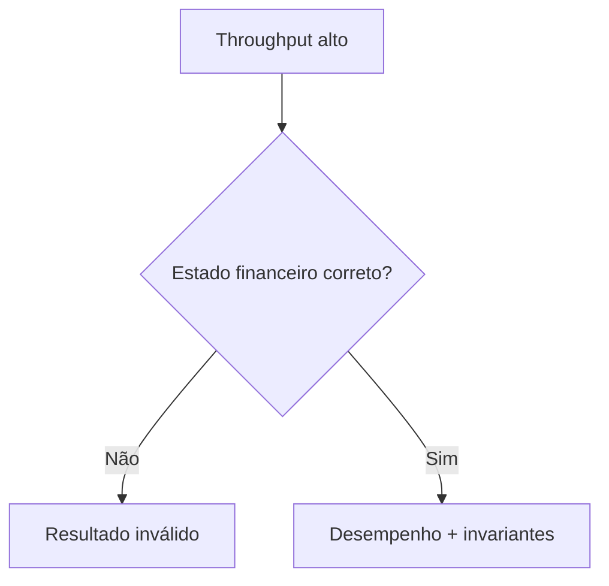
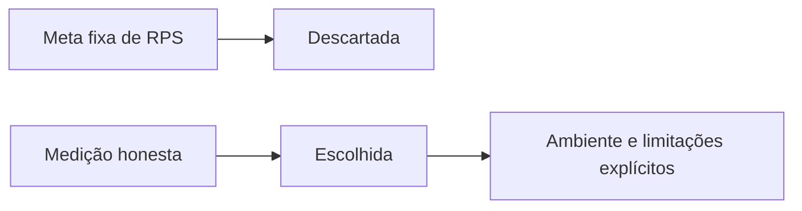
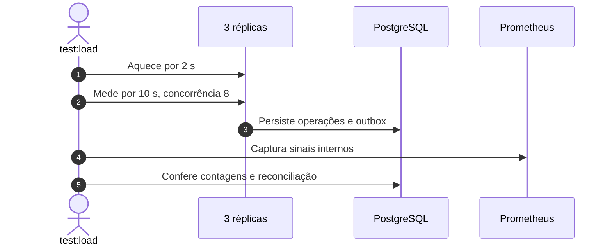
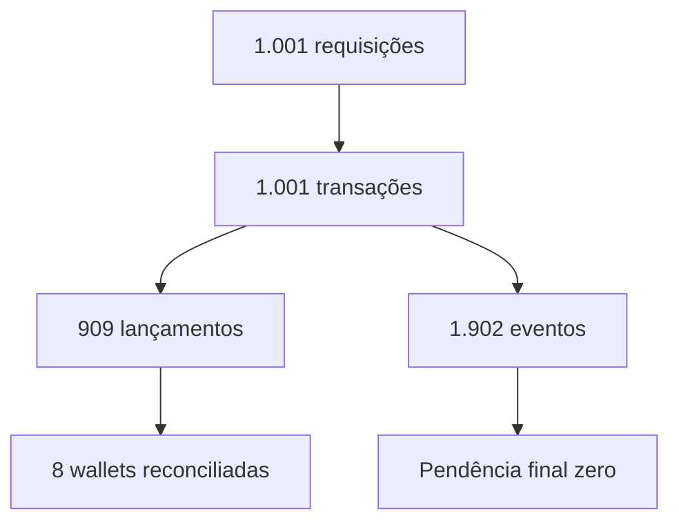
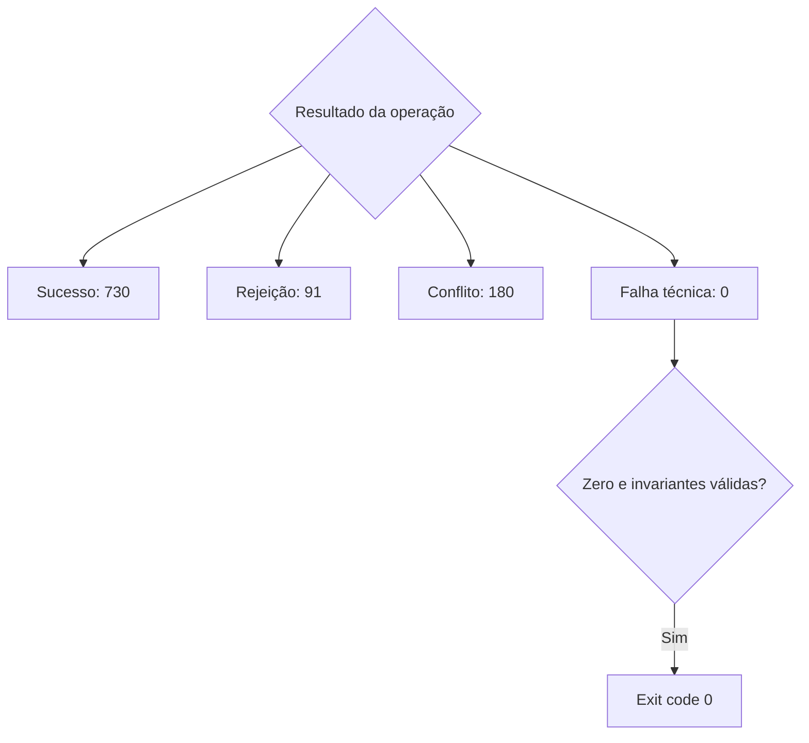
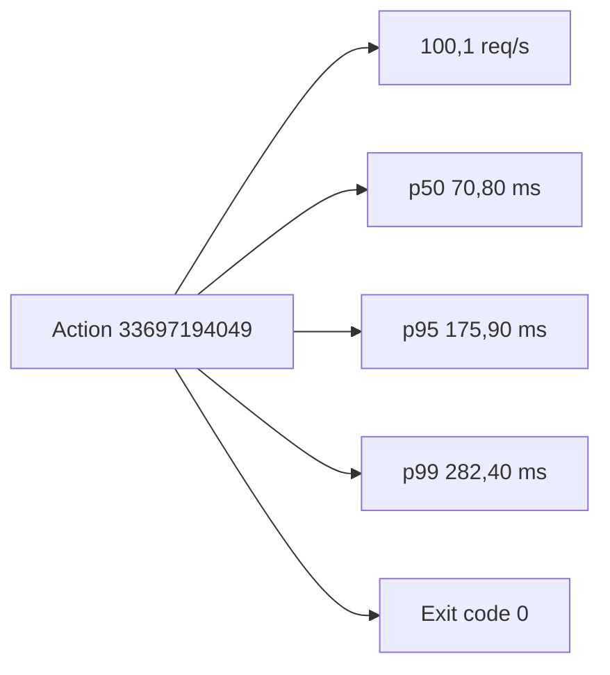

# Evidência de carga curta

## Visão geral e objetivo

Medir uma carga curta reproduzível e confirmar que desempenho observado não
compromete as invariantes financeiras.

## Contexto do problema

RPS e percentis isolados não constituem sucesso quando há falha técnica,
outbox pendente ou divergência entre wallet e ledger.

## Decisões e trade-offs

Não há meta mínima de RPS. O gate falha por erro técnico, quebra de invariante
ou outbox sem convergência.

## Fluxo ponta a ponta

## Estrutura e invariantes

As fórmulas de contagem e `wallet.balance == saldo reconstruído pelo ledger`
foram verificadas automaticamente ao término.

## Resiliência e falhas

Categorias de resultado permanecem separadas para não classificar rejeições de
negócio ou conflitos idempotentes como indisponibilidade técnica.

## Evidência verificável

O artefato do Action registra commit, ambiente, massa isolada, comandos,
metodologia, 1.001 requisições e convergência da outbox de pico 903 para zero.
São métricas do runner hospedado pelo GitHub, não um SLO de produção.

## Referências no código

- [Relatório completo](../docs/load/short-load-report.md)
- [Runner de carga](../scripts/load/run-short-load.ts)
- [Contrato do relatório](../scripts/load/load-report.ts)
- [Dashboard Grafana](../docker/grafana/provisioning/dashboards/wagering-dashboard.json)
- [Action verde — job `load-test`](https://github.com/renansko/jugle-gaming-test/actions/runs/33697194049)
