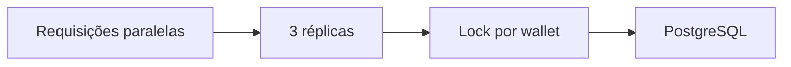
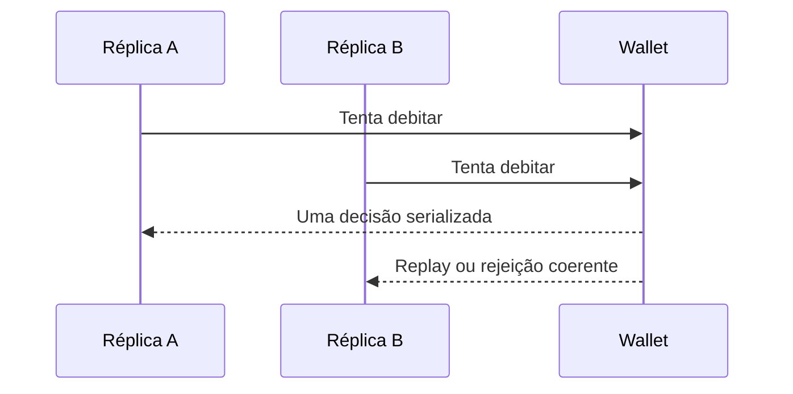
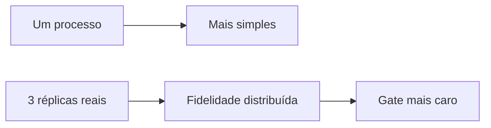
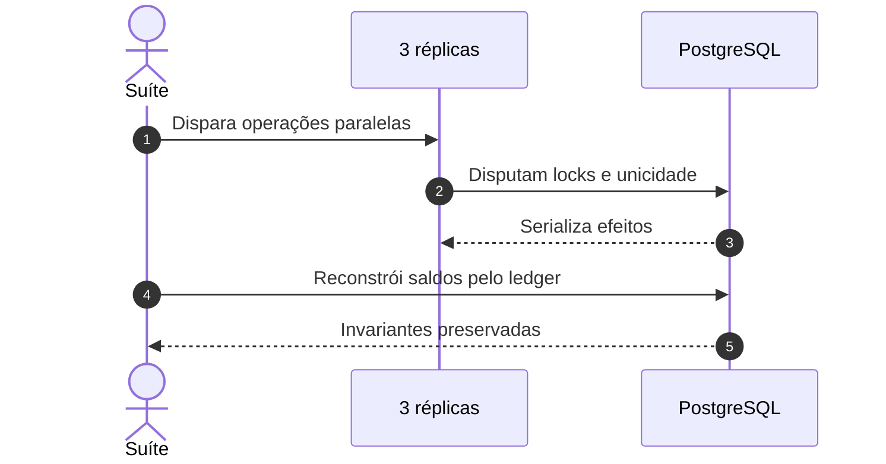
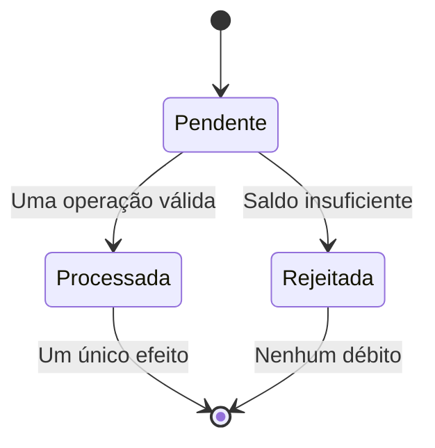
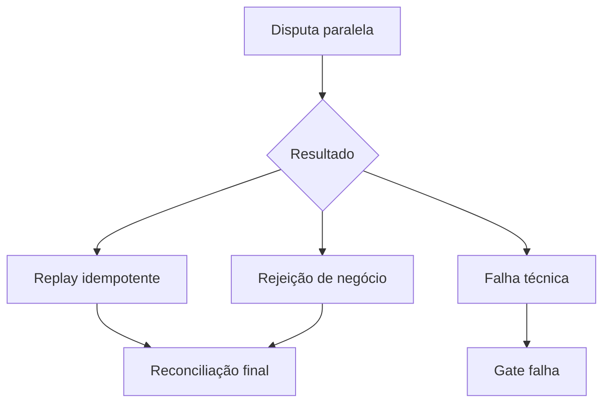
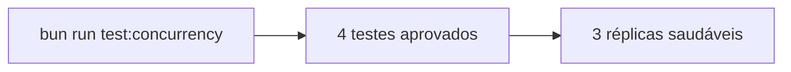

# Evidência de testes de concorrência

## Visão geral e objetivo

Provar idempotência e invariantes financeiras sob disputa real entre pelo menos
três réplicas da aplicação.

## Contexto do problema

Sem coordenação no banco, requisições simultâneas poderiam duplicar débitos ou
produzir saldo negativo.

## Decisões e trade-offs

O Compose remove a porta host da aplicação e distribui chamadas pelo DNS
interno, aceitando maior tempo de execução para evitar uma falsa prova local.

## Fluxo ponta a ponta

## Estrutura e invariantes

Retry idêntico produz um débito; duas apostas de 80 sobre saldo 100 deixam uma
processada e outra rejeitada; wallets distintas avançam em paralelo.

## Resiliência e falhas

Falhas técnicas permanecem separadas de rejeições válidas e conflitos
idempotentes.

## Evidência verificável

O job `integration` do Action 33697194049 aprovou **4 testes de concorrência**
em três réplicas, incluindo a reconciliação matemática do banco.

## Referências no código

- [Testes de concorrência](../tests/concurrency)
- [Compose de hardening](../compose.hardening.yaml)
- [Convenção de concorrência](../docs/brain/conventions/Concurrency.md)
- [Action verde — job `integration`](https://github.com/renansko/jugle-gaming-test/actions/runs/33697194049)
