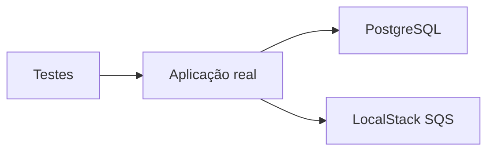
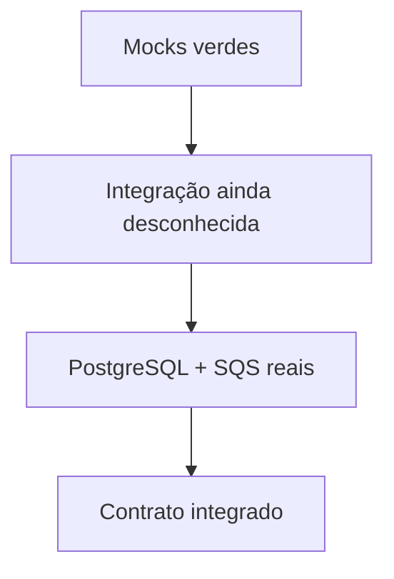
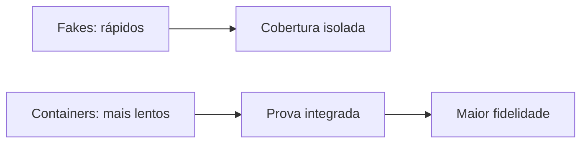
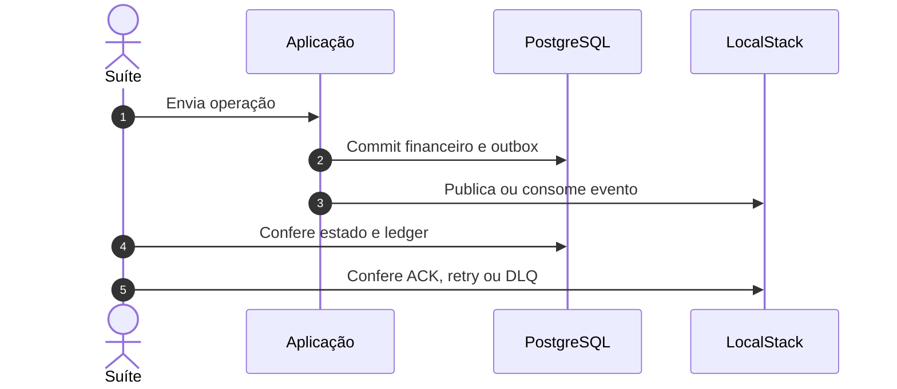
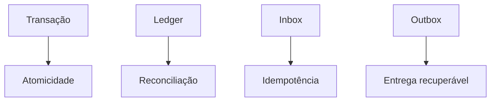
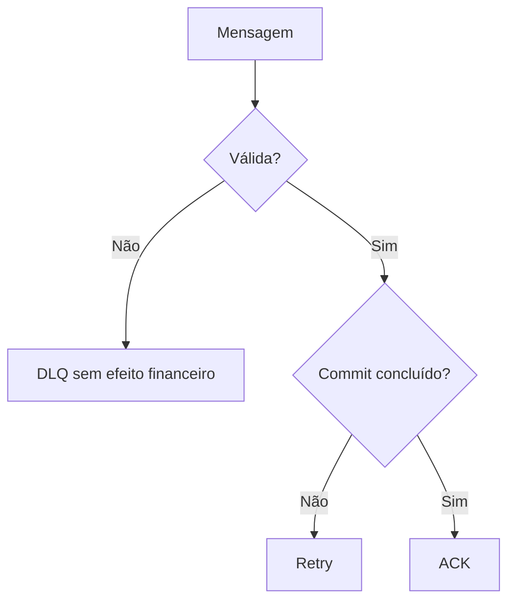
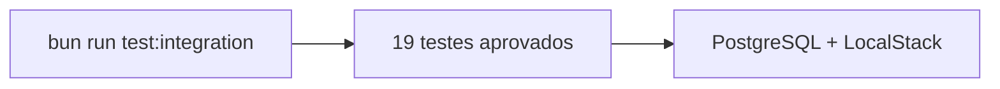

# Evidência de testes de integração

## Visão geral e objetivo

Comprovar contratos HTTP, persistência, mensageria, DLQ, referências e métricas
contra dependências reais.

## Contexto do problema

Testes isolados não detectam divergências de schema, constraints, ACK, retry ou
serialização na fronteira externa.

## Decisões e trade-offs

O custo de containers é aceito no gate para validar as mesmas tecnologias do
ambiente documentado.

## Fluxo ponta a ponta

## Estrutura e invariantes

As verificações relevantes confirmam saldo reconstruível, contagens coerentes
e efeitos financeiros atômicos.

## Resiliência e falhas

A suíte diferencia falha transitória, rejeição de domínio e mensagem inválida.

## Evidência verificável

O job `integration` do Action 33703096311 executou `bun run hardening` e aprovou
**19 testes de integração** com PostgreSQL e LocalStack. A contagem não inclui
os quatro testes de concorrência executados em seguida.

## Referências no código

- [Testes de integração](../tests/integration)
- [Harness compartilhado](../tests/support)
- [Workflow de CI](../.github/workflows/ci.yml)
- [Action verde — job `integration`](https://github.com/renansko/jugle-gaming-test/actions/runs/33703096311)
