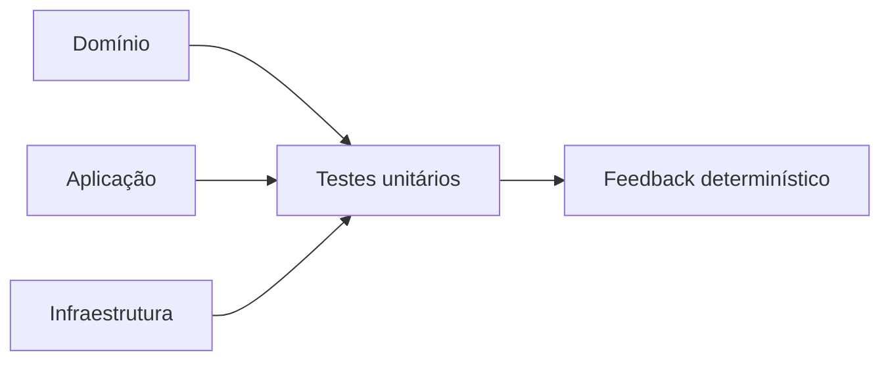
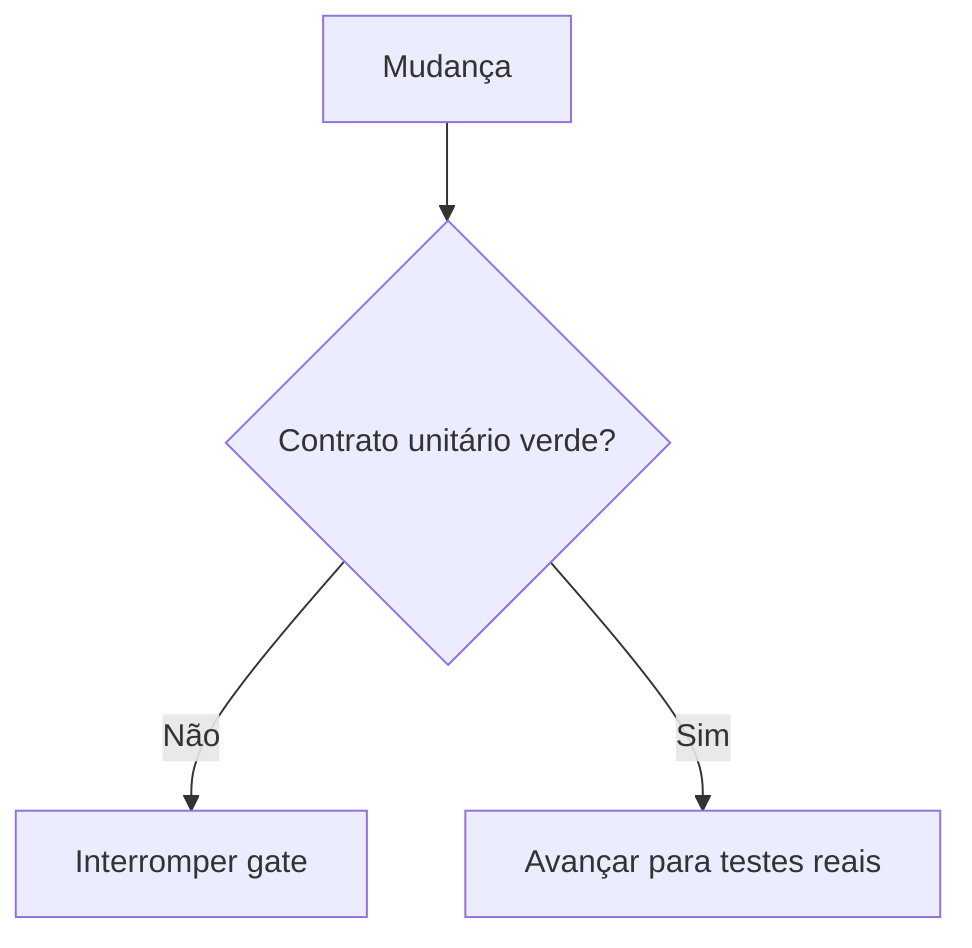
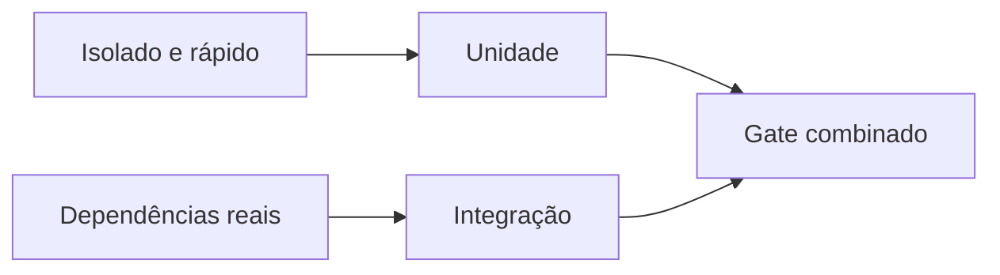
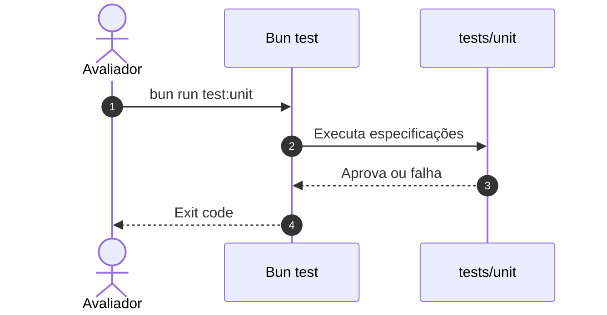
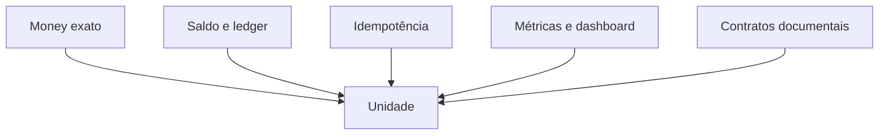
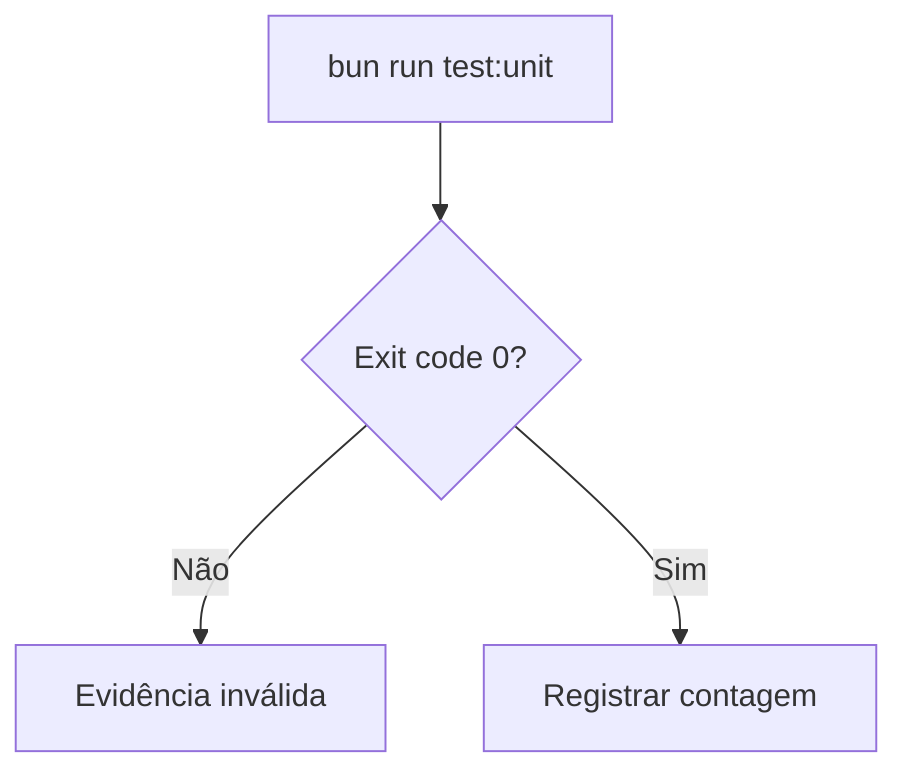
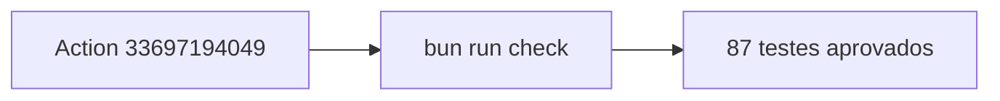

# Evidência de testes unitários

## Visão geral e objetivo

Provar regras isoladas, contratos documentais e instrumentação sem depender da
stack distribuída.

## Contexto do problema

Testes unitários reduzem o espaço de falha, mas não comprovam PostgreSQL, SQS
ou disputa entre réplicas.

## Decisões e trade-offs

A evidência unitária é apresentada separadamente para não sugerir cobertura de
integrações reais.

## Fluxo ponta a ponta

## Estrutura e invariantes

O conjunto cobre domínio financeiro, aplicação, workers, observabilidade e os
contratos de documentação executáveis.

## Resiliência e falhas

Falha, timeout ou interrupção invalidam a execução; não se registra resultado
parcial como suíte verde.

## Evidência verificável

O job `check` do Action 33697194049 aprovou **87 testes unitários**, com lint e
TypeScript verdes. O job `integration` repetiu essa suíte dentro de
`bun run hardening` antes dos testes com dependências reais.

## Referências no código

- [Testes unitários](../tests/unit)
- [Script `test:unit`](../package.json)
- [Workflow de CI](../.github/workflows/ci.yml)
- [Action verde — job `check`](https://github.com/renansko/jugle-gaming-test/actions/runs/33697194049)
