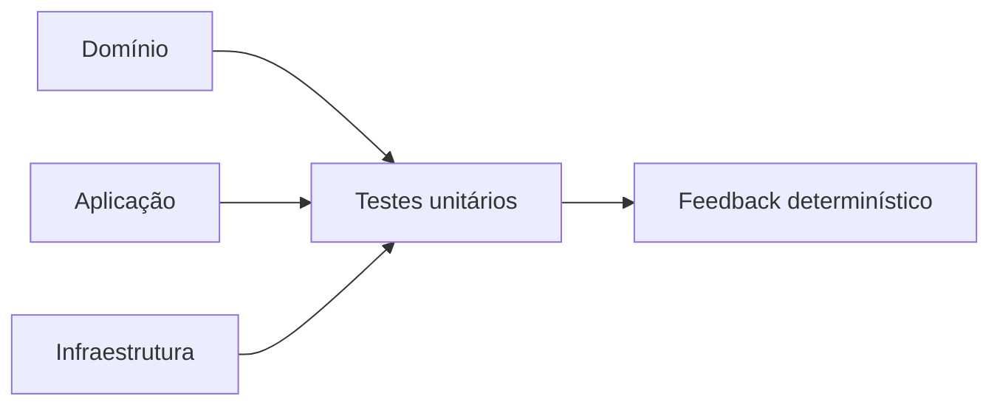
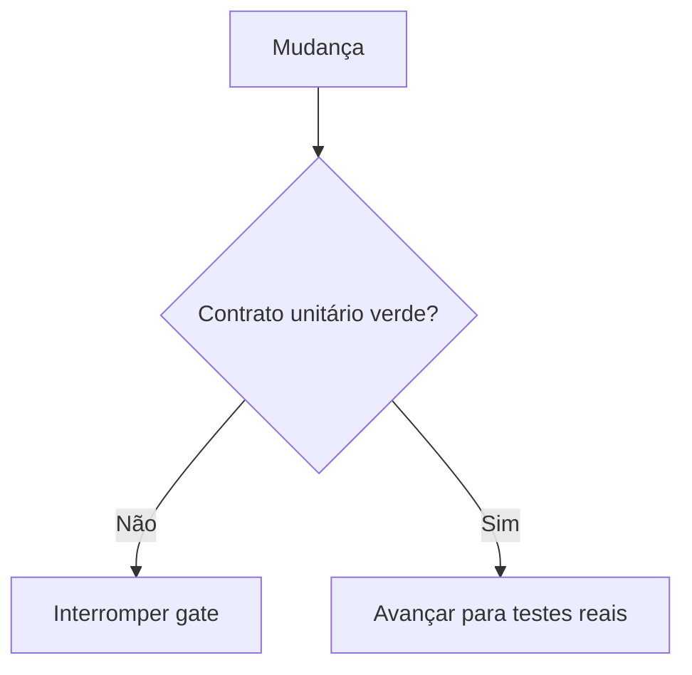
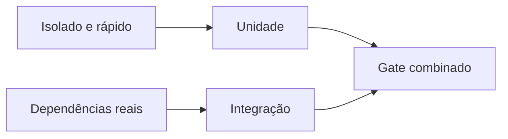
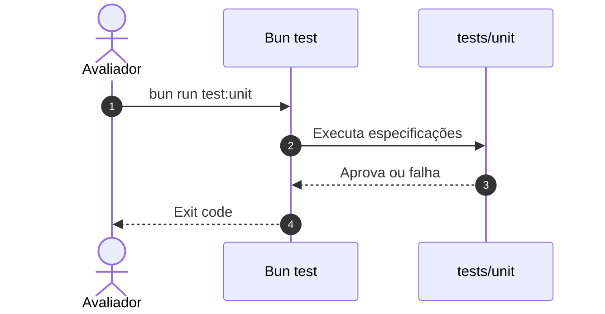
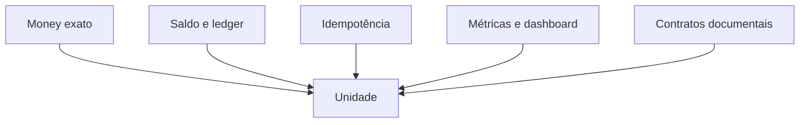
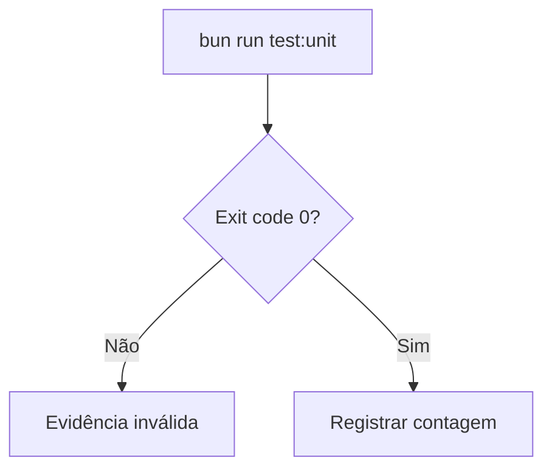
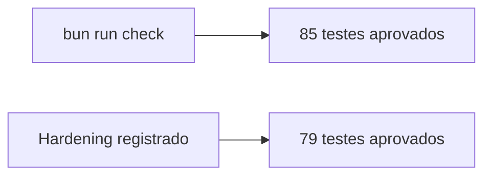

# Evidência de testes unitários — issue #13

## Visão geral e objetivo

Provar regras isoladas, contratos documentais e instrumentação sem depender da
stack distribuída.

## Contexto do problema

Testes unitários reduzem o espaço de falha, mas não comprovam PostgreSQL, SQS
ou disputa entre réplicas.

## Decisões e trade-offs

A evidência unitária é apresentada separadamente para não sugerir cobertura de
integrações reais.

## Fluxo ponta a ponta

## Estrutura e invariantes

O conjunto cobre domínio financeiro, aplicação, workers, observabilidade e os
contratos de documentação executáveis.

## Resiliência e falhas

Falha, timeout ou interrupção invalidam a execução; não se registra resultado
parcial como suíte verde.

## Evidência verificável

O check local em Docker de 2026-09-02 aprovou **85 testes unitários**, com lint
e TypeScript verdes. O hardening registrado em 2026-09-01 aprovou **79**; essa
contagem anterior permanece identificada para não reescrever evidência
histórica. A execução pública atual deve ser consultada no CI.

## Referências no código

- [Testes unitários](../tests/unit)
- [Script `test:unit`](../package.json)
- [Workflow de CI](../.github/workflows/ci.yml)
- [Issue #13](https://github.com/renansko/jugle-gaming-test/issues/13)
